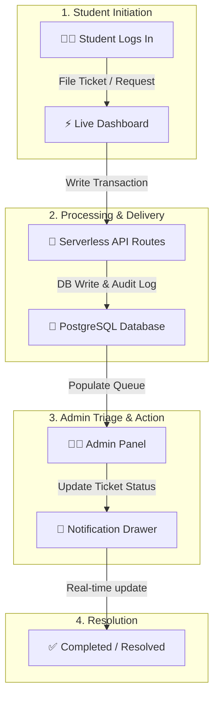
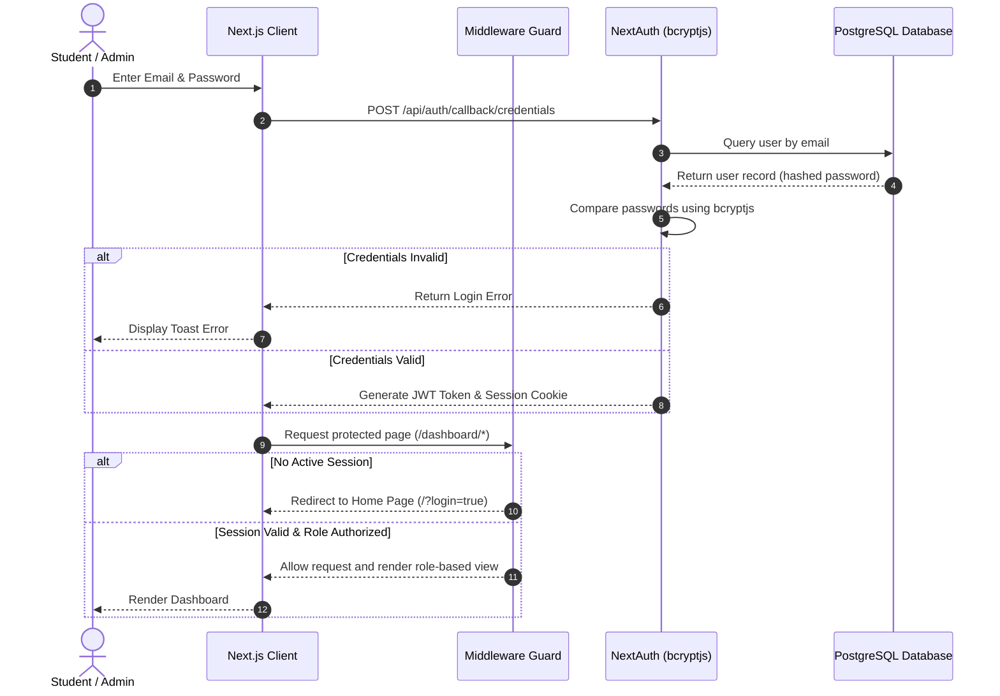
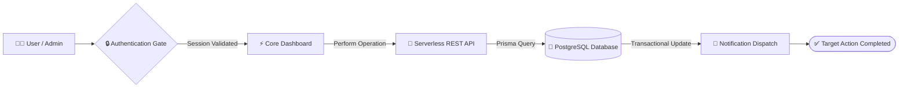

<div align="center">


<br />

# 🎓 Smart Campus Service Hub

### *A premium, unified digital portal for modern campus service requests, resource management, and administrative analytics.*

<p align="center">
  <a href="https://smart-campus-management-4rg6.vercel.app/"><b>🚀 Live Demo</b></a> •
  <a href="#installation"><b>⚙️ Setup Guide</b></a> •
  <a href="#api-overview"><b>📡 API Reference</b></a> •
  <a href="https://github.com/gaurav-spnrec/smart-campus-management-1/issues"><b>🐛 Report Bug</b></a> •
  <a href="https://github.com/gaurav-spnrec/smart-campus-management-1/issues"><b>💡 Request Feature</b></a>
</p>

[](https://smart-campus-management-4rg6.vercel.app/)
[](https://github.com/gaurav-spnrec/smart-campus-management-1.git)
[](LICENSE)

[](https://github.com/gaurav-spnrec/smart-campus-management-1/stargazers)
[](https://github.com/gaurav-spnrec/smart-campus-management-1/network/members)
[](https://github.com/gaurav-spnrec/smart-campus-management-1/commits/main)

<p align="center">
  
  
  
  
  
  
  
  
  
</p>

</div>

---

<a id="live-demo"></a>
## 🎥 Live Demo

<div align="center">
  
  <p><i>Full application walkthrough showcasing real-time notices, service logs, and analytics.</i></p>
</div>

---

## 📖 Table of Contents

- [🎥 Live Demo](#live-demo)
- [📖 About Project](#about-project)
- [🚨 Problem Statement](#problem-statement)
- [🚀 Proposed Solution](#proposed-solution)
- [✨ Key Features](#key-features)
- [📸 Screenshots](#screenshots)
- [🛠️ Technology Stack](#technology-stack)
- [🏗️ System Architecture](#system-architecture)
- [🔒 Authentication Flow](#authentication-flow)
- [🔄 Project Workflow](#project-workflow)
- [📂 Folder Structure](#folder-structure)
- [⚙️ Installation](#installation)
- [📝 Environment Variables](#environment-variables)
- [👤 Demo Credentials](#demo-credentials)
- [🌐 Deployment](#deployment)
- [📡 API Overview](#api-overview)
- [🛡️ Security](#security)
- [⚡ Performance](#performance)
- [🔮 Roadmap](#roadmap)
- [🤝 Contributing](#contributing)
- [📄 License](#license)
- [🧔 Developer](#developer)

---

<a id="about-project"></a>
## 📖 About Project

The **Smart Campus Service Hub** is a centralized, role-based platform designed to eliminate administrative friction in academic environments. Traditional campuses often rely on fragmented notice boards, physical paperwork, and opaque workflows to handle daily operational needs. 

This platform bridges that gap by introducing a modern web portal. Students gain immediate access to request official documents, report infrastructure failures, and claim lost items under a secure interface. Meanwhile, administrators benefit from automated ticket routing, notice broadcast schedulers, resource distribution dashboards, and live audit analytics—all packaged in an intuitive, responsive glassmorphic design.

---

<a id="problem-statement"></a>
## 🚨 Problem Statement

Campus operations are frequently slowed down by manual overhead. The matrix below outlines how the **Smart Campus Service Hub** addresses these core logistical bottlenecks:

| Traditional Campus Challenges | Smart Campus Service Hub Solutions |
| :--- | :--- |
| **📢 Fragmented Communication**<br>Notices are scattered across physical boards or informal chat groups, leading to missed deadlines and outdated information. | **⚡ Centralized Notice Board**<br>A unified, priority-tagged announcement feed featuring automated expiration filters to keep students informed. |
| **📄 Paper-Heavy Administration**<br>Certificate applications, ID replacements, and academic forms require physical queues and manual signature routing. | **🔒 Role-Protected Digital Forms**<br>Secure, online service request workflows where students apply, submit proofs, and track progress instantly. |
| **🛠️ Opaque Maintenance Logging**<br>Infrastructure bugs (broken lights, leakages) are verbalized or forgotten, without tracking or accountability. | **👁️ Auditable Issue Logs**<br>Interactive, real-time ticket timelines showing assignment details, priority, and progress. |
| **🎒 Disorganized Claiming**<br>Lost-and-found operations rely on paper registries, opening loopholes for duplicate claims and lost receipts. | **🏷️ Verifiable Claims Engine**<br>A structured claim board requiring image uploads. Automated logic locks approvals and auto-rejects duplicate claims. |

---

<a id="proposed-solution"></a>
## 🚀 Proposed Solution

The Smart Campus Service Hub automates the student-to-administrator lifecycle using a serverless-ready architecture. The operational flow operates as follows:



---

<a id="key-features"></a>
## ✨ Key Features

### 🔐 NextAuth Protection & RBAC
- **Description**: Secure, token-based session management using dynamic route wrappers.
- **Benefit**: Ensures students and administrators only access views and database actions allowed by their role.

### 🛠️ Intelligent Request Triage
- **Description**: An automated parser scans tickets for critical keywords to auto-compute severity.
- **Benefit**: Highlights urgent maintenance issues immediately, optimizing dispatcher triage time.

### 📢 Priority notice board
- **Description**: A scheduling board where administrators can post announcements containing attachments.
- **Benefit**: Keeps the campus updated in real-time, using automated filters to hide expired posts.

### 🎒 Verified claims engine
- **Description**: A media-rich lost and found listing dashboard backed by cloud storage uploads.
- **Benefit**: Streamlines claims validation by requiring visual proof and auto-canceling duplicate claims on item approvals.

### 📄 Shared resource directory
- **Description**: A digital repository for downloading guidelines, timetables, and official campus documents.
- **Benefit**: Saves students from making office visits to pick up physical handouts.

### 📡 Auditable CRUD APIs
- **Description**: High-speed, transactional endpoints secured by schema validation and access checks.
- **Benefit**: Guarantees database integrity and provides clear integration points for campus systems.

---

<a id="screenshots"></a>
## 📸 Screenshots

<div align="center">

| <a href="screenshots/01-landing-page.png"></a> | <a href="screenshots/04-student-dashboard.png"></a> | <a href="screenshots/05-notices-event.png"></a> |
|:---:|:---:|:---:|
| **Landing Portal** | **Student Dashboard** | **Notices & Events Board** |
| <a href="screenshots/06-lost-found.png"></a> | <a href="screenshots/07-resource-hub.png"></a> | <a href="screenshots/08-service-request.png"></a> |
| **Lost & Found Hub** | **Resource Directory** | **Service Requests Portal** |
| <a href="screenshots/10-admin-dashboard.png"></a> | <a href="screenshots/11-student-management.png"></a> | <a href="screenshots/12-analytics-hub.png"></a> |
| **Admin Operations Control** | **Student User Management** | **Analytics & Audit Hub** |

</div>

---

<a id="technology-stack"></a>
## 🛠️ Technology Stack

| Component | Framework / Library | Role | Version |
| :--- | :--- | :--- | :--- |
| **Frontend Framework** | `Next.js` (App Router) | Server-Side Rendering (SSR) & routing structures | `16.2.6` |
| **UI Library** | `React` | Interactive views and client-side lifecycle management | `19.2.4` |
| **Styling** | `Tailwind CSS` | Fully responsive layouts and glassmorphic designs | `v4.0` |
| **Database ORM** | `Prisma` | Type-safe schema definition and query builder | `5.18.0` |
| **Database** | `PostgreSQL` | Relational storage database | - |
| **Authentication** | `NextAuth` | Credentials-based JWT security and session encryption | `4.24.14` |
| **Data Fetching** | `SWR` | Optimistic UI updates and cache polling configurations | `2.4.2` |
| **File Handler** | `UploadThing` | Multi-format image and attachment uploads | `7.7.4` |

---

<a id="system-architecture"></a>
## 🏗️ System Architecture

The following diagram illustrates how requests pass from the browser to the application stack:


---

<a id="authentication-flow"></a>
## 🔒 Authentication Flow

This diagram traces credentials verification and route authentication in the middleware:



---

<a id="project-workflow"></a>
## 🔄 Project Workflow

This flowchart maps the operational lifecycle of a service request inside the system:



---

<a id="folder-structure"></a>
## 📂 Folder Structure

```text
smart-campus-management/
├── prisma/                 # Database schema models & seed scripts
├── public/                 # Static assets & public resources
├── screenshots/            # UI screenshot gallery
└── src/
    ├── app/                # App Router files & Serverless API layers
    │   ├── api/            # Role-protected API route endpoints
    │   └── dashboard/      # Unified dynamic dashboard layouts
    ├── components/         # Reusable core client components
    ├── lib/                # Database config & NextAuth callbacks
    └── middleware.ts       # Route guard middleware
```

---

<a id="installation"></a>
## ⚙️ Installation

### 1. Clone the Project
```bash
git clone https://github.com/gaurav-spnrec/smart-campus-management-1.git
cd smart-campus-management-1
```

### 2. Configure Environment
Create a `.env` file in the root directory (refer to [Environment Variables](#environment-variables)).

### 3. Install Dependencies
```bash
npm install
```

### 4. Push Database Schema
Generate database clients and apply models:
```bash
npx prisma generate
npx prisma db push
```

### 5. Seed Initial Data
Populate user roles and mock datasets:
```bash
npx prisma db seed
```

### 6. Launch Local Server
```bash
npm run dev
```
Open [http://localhost:3000](http://localhost:3000) to view the application locally.

---

<a id="environment-variables"></a>
## 📝 Environment Variables

| Variable | Required | Role | Description |
| :--- | :--- | :--- | :--- |
| `DATABASE_URL` | **Yes** | Connection Pool | The PostgreSQL connection string used by Prisma to query the database (e.g. Transaction Pool). |
| `DIRECT_URL` | **Yes** | Direct Connection | Connection string used to bypass poolers for executing migrations directly. |
| `NEXTAUTH_SECRET` | **Yes** | Encryption Key | Secret key used to encrypt cookie tokens and sign JSON Web Tokens. |
| `NEXTAUTH_URL` | **Yes** | Web Domain URL | The base URL of the site, used for callback routing (e.g. `http://localhost:3000`). |
| `UPLOADTHING_TOKEN`| *No* | File Uploads | Client token enabling upload endpoints. Falls back to a local simulated mock if empty. |

---

<a id="demo-credentials"></a>
## 👤 Demo Credentials

For testing the application locally or auditing the live deployment, use the credentials below:

*   **Administrator Portal**
    *   **Email**: `admin@campus.edu`
    *   **Password**: `admin123`
*   **Student Portal**
    *   **Email**: `student@campus.edu`
    *   **Password**: `student123`

---

<a id="deployment"></a>
## 🌐 Deployment

The codebase is fully optimized for serverless deployments on platforms like **Vercel**:

1. Push code changes to a Git repository.
2. Link the repository to your Vercel Dashboard.
3. Apply the variables from your `.env` to the **Environment Variables** tab in settings.
4. Deploy. Vercel automatically runs the build and deploys schema syncs using `npm run build`.

---

<a id="api-overview"></a>
## 📡 API Overview

All API endpoints (except authentication callback) check incoming request cookies to enforce authorization scope.

<details>
<summary>🔑 Authentication & User Management APIs</summary>

| Endpoint | Method | Allowed Role | Purpose |
| :--- | :--- | :--- | :--- |
| `/api/auth/register` | `POST` | Public | Registers a new student account. |
| `/api/students` | `GET` | Admin | Fetches paginated student user records. |
| `/api/students` | `PUT` | Admin | Updates profiles of existing students. |
| `/api/students` | `DELETE` | Admin | Deletes student accounts from the database. |

</details>

<details>
<summary>📢 Announcement & Notice Board APIs</summary>

| Endpoint | Method | Allowed Role | Purpose |
| :--- | :--- | :--- | :--- |
| `/api/notices` | `GET` | Authenticated | Retrieves current notice feeds. |
| `/api/notices` | `POST` | Admin | Publishes a priority-tagged circular. |
| `/api/notices` | `DELETE` | Admin | Deletes an active circular. |

</details>

<details>
<summary>🛠️ Service Request & Issue Logging APIs</summary>

| Endpoint | Method | Allowed Role | Purpose |
| :--- | :--- | :--- | :--- |
| `/api/issues` | `GET` | Authenticated | Lists raised tickets (scoped to student, or full list for admin). |
| `/api/issues` | `POST` | Student | Logs a new maintenance request or issue. |
| `/api/issues` | `PATCH` | Admin | Updates request status, priority levels, or assigns logs. |

</details>

<details>
<summary>🎒 Lost & Found Claims Engine APIs</summary>

| Endpoint | Method | Allowed Role | Purpose |
| :--- | :--- | :--- | :--- |
| `/api/lost-found` | `GET` | Authenticated | Fetches all open lost and found items. |
| `/api/lost-found` | `POST` | Authenticated | Lists a lost or found item. |
| `/api/lost-found` | `DELETE` | Admin / Owner | Deletes an active listing. |
| `/api/lost-found/claim`| `GET` | Authenticated | Fetches all pending claim applications. |
| `/api/lost-found/claim`| `POST` | Student | Submits an ownership claim with image proofs. |
| `/api/lost-found/claim`| `PATCH` | Admin | Resolves claim status. Approvals auto-reject overlapping claims. |

</details>

<details>
<summary>🔔 Status Notification Drawer APIs</summary>

| Endpoint | Method | Allowed Role | Purpose |
| :--- | :--- | :--- | :--- |
| `/api/notifications` | `GET` | Authenticated | Lists unread status alerts. |
| `/api/notifications` | `PATCH` | Authenticated | Marks alerts as read. |

</details>

---

<a id="security"></a>
## 🛡️ Security

- **Session Security**: Stateless sessions managed through NextAuth JSON Web Tokens (JWT) encrypted with HMAC keys.
- **Access Guarding**: Next.js Server-side middleware intercepts request routing to redirect unauthorized sessions.
- **Account Enclosure**: Salts and hashes passwords before database saving using multi-round `bcryptjs` routines.
- **RBAC API Verification**: Middleware endpoint controls query user context to abort request access for unauthorized roles.

---

<a id="performance"></a>
## ⚡ Performance

- **Caching Queries**: Client fetches utilize `SWR` caching hooks, reducing database stress by serving stale data during revalidation.
- **React Server Components**: Static information blocks are rendered at build-time, minimizing browser JavaScript weight.
- **Prisma Reuse**: Implements database client reuse models to prevent execution pool exhaustion.
- **Asset Fallbacks**: Uses localized placeholder scripts to maintain layout speed when third-party upload services encounter high latency.

---

<a id="roadmap"></a>
## 🔮 Roadmap

- [ ] **🤖 AI Assistant Integration** — Connect LLM-driven FAQ bots to resolve recurring queries automatically.
- [ ] **🔔 Web Push Protocols** — Implement real-time notifications for immediate exam schedules and emergency notices.
- [ ] **📅 Calendar Synchronizer** — Enable students to sync events and deadlines to Google Calendar & Outlook.
- [ ] **🎫 QR Claim Validation** — Introduce secure QR code check-ins for verification of item claims.
- [ ] **📱 Native App Wrapper** — Package layout templates into Android and iOS containers using Capacitor.

---

<a id="contributing"></a>
## 🤝 Contributing

Contributions make the open-source community an amazing place to learn and build. To participate:

1. Fork the repository.
2. Build your feature branch (`git checkout -b feature/AmazingFeature`).
3. Commit your changes (`git commit -m 'Add some AmazingFeature'`).
4. Push to your branch (`git push origin feature/AmazingFeature`).
5. Open a Pull Request.

---

<a id="license"></a>
## 📄 License

Distributed under the MIT License. See [LICENSE](LICENSE) for more details.

---

<a id="developer"></a>
## 🧔 Developer

<div align="center">

Designed and developed with ❤️ by **Gaurav Kumar**.

<p align="center">
  <a href="https://github.com/gaurav-spnrec"></a>
  <a href="https://www.linkedin.com/in/gauravbuildz/"></a>
</p>

---

⭐ **If you found this project helpful, please star the repository!**

---

</div>
