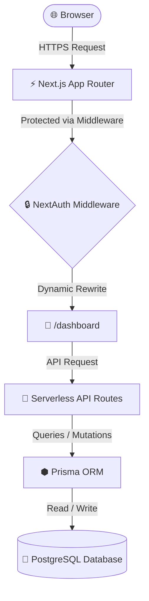
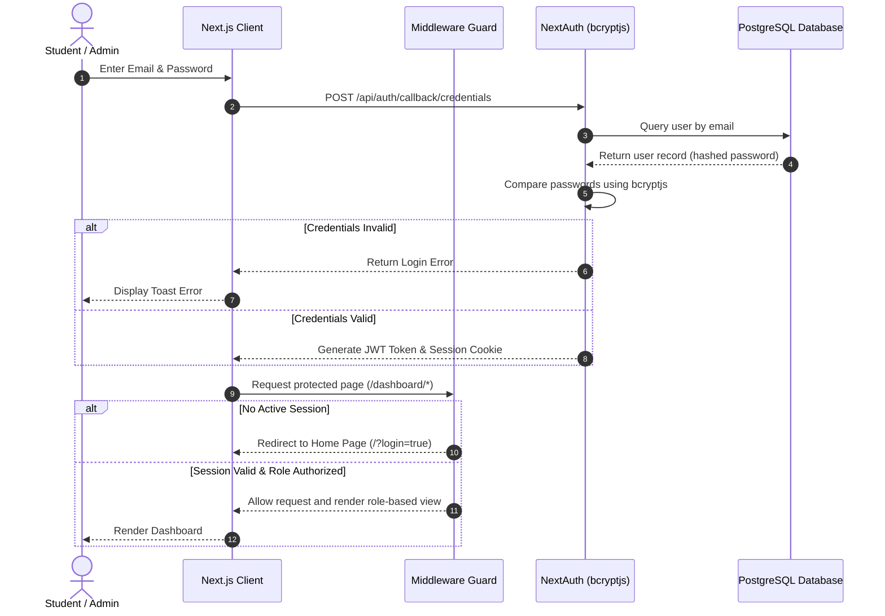
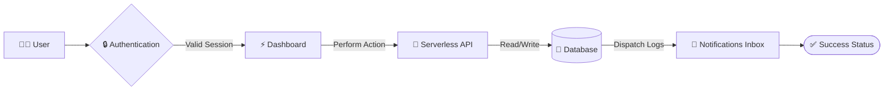

<div align="center">


<br />

# 🎓 Smart Campus Service Hub

### *An online portal for students to submit requests, report infrastructure issues, and track lost-and-found items.*

[](https://smart-campus-management-4rg6.vercel.app/)
[](https://www.youtube.com/watch?v=your-video-id)
[](https://github.com/gaurav-spnrec/smart-campus-management-1.git)
[](LICENSE)

[](https://github.com/gaurav-spnrec/smart-campus-management-1/stargazers)
[](https://github.com/gaurav-spnrec/smart-campus-management-1/network/members)
[](https://github.com/gaurav-spnrec/smart-campus-management-1/commits/main)

<p align="center">
  
  
  
  
  
  
  
  
  
</p>

---

</div>

## Table of Contents

- [🎥 Walkthrough](#walkthrough)
- [📖 About Project](#about-project)
- [🎯 Why Smart Campus Service Hub?](#why-smart-campus-service-hub)
- [🚨 Problem Statement](#problem-statement)
- [🚀 Proposed Solution](#proposed-solution)
- [✨ Highlights](#highlights)
- [🔑 Key Features](#key-features)
- [📸 Screenshots](#screenshots)
- [🛠️ Technology Stack](#technology-stack)
- [🏗️ System Architecture](#system-architecture)
- [🔒 Authentication Flow](#authentication-flow)
- [🔄 Project Workflow](#project-workflow)
- [📂 Folder Structure](#folder-structure)
- [⚙️ Installation](#installation)
- [📝 Environment Variables](#environment-variables)
- [👤 Demo Credentials](#demo-credentials)
- [🌐 Deployment](#deployment)
- [📡 API Overview](#api-overview)
- [🛡️ Security](#security)
- [⚡ Performance](#performance)
- [🔮 Roadmap](#roadmap)
- [🤝 Contributing](#contributing)
- [📄 License](#license)
- [🧔 Developer](#developer)

---

<a id="walkthrough"></a>
## Walkthrough

<div align="center">
  
  <p><i>Complete application walkthrough</i></p>

  <br />

  <p align="center">
    <a href="https://smart-campus-management-4rg6.vercel.app/"><b>🚀 Live Demo</b></a> •
    <a href="https://www.youtube.com/watch?v=your-video-id"><b>🎥 Watch Demo</b></a> •
    <a href="https://github.com/gaurav-spnrec/smart-campus-management-1.git"><b>💻 Source Code</b></a>
  </p>
</div>

---

<a id="about-project"></a>
## About Project

This portal is built to handle everyday campus tasks online. It gives students a single place to apply for documents (like certificates or ID cards), report physical maintenance issues (like broken lights or classroom problems), and post lost-and-found items. Administrators can log in to view the queue of requests, update their status, and broadcast notices to the student body.

---

<a id="why-smart-campus-service-hub"></a>
## Why Smart Campus Service Hub?

On a typical campus, students have to visit administrative offices in person to submit paper forms or ask about lost items, and maintenance issues are often reported verbally and forgotten. This portal moves these tasks online so they can be tracked, assigned, and resolved from a single dashboard.

> [!TIP]
> **For Students**: Request documents, report lost items, and track maintenance tickets in real-time without having to visit office desks.

> [!IMPORTANT]
> **For Administrators**: Centralize request routing, broadcast campus notices, and track ticket resolutions using a single dashboard.

---

<a id="problem-statement"></a>
## Problem Statement

Currently, campus communication and services are scattered. Notices are posted on physical bulletin boards or WhatsApp groups where they quickly get lost. Applying for document replacements requires physical paperwork and queues. Infrastructure issues like broken lights or offline WiFi routers are rarely logged formally, and lost items are tracked in paper registers that are hard to search and verify.

---

<a id="proposed-solution"></a>
## Proposed Solution

The portal automates these requests. Students log in, select the service they need, and fill out a digital form with details and image proofs. Administrators see these submissions in their dashboard, where they can update the status (such as Pending, In Progress, or Resolved). Any status update sends a notification directly to the student’s inbox, keeping them informed without requiring office visits.

---

<a id="highlights"></a>
## Highlights

| ⚡ Lightning Fast | 🔒 Built Secure | 📱 Fully Responsive |
| :--- | :--- | :--- |
| Client-side queries leverage `SWR` caching for real-time responsiveness. | Password hashing with `bcryptjs` and path guards via NextAuth. | Native support for desktop sidebars and mobile drawer lists. |

| 🎯 Role-Based (RBAC) | 📊 Live Analytics | ☁️ Cloud Ready |
| :--- | :--- | :--- |
| Dynamic route rewrites for students and administrators. | Admin dashboard displaying issue distributions and statistics. | Engineered for Vercel Serverless and PostgreSQL cloud pools. |

---

<a id="key-features"></a>
## Key Features

- **🔐 NextAuth Protection**: Dynamic dashboard interfaces served according to student/admin JWT permissions.
- **🛠️ Automated Ticketing**: Key-word matching auto-calculates severity level (`HIGH` or `LOW`) for faster triage.
- **📢 Notice Board**: Broadcast events, exam schedules, and circulars with attachment options.
- **🎒 Claims Engine**: Submit image claims on found items. Admin approvals auto-reject duplicate claims.
- **📄 Forms Directory**: Downloadable course guidelines, timetables, and documents in one shared hub.
- **📡 Serverless APIs**: Fully audited CRUD endpoints validating access scopes.

---

<a id="screenshots"></a>
## Screenshots

| <a href="screenshots/01-landing-page.png"></a> | <a href="screenshots/04-student-dashboard.png"></a> | <a href="screenshots/05-notices-event.png"></a> |
|:---:|:---:|:---:|
| **Landing Page** | **Student Dashboard** | **Notices & Events** |
| <a href="screenshots/06-lost-found.png"></a> | <a href="screenshots/07-resource-hub.png"></a> | <a href="screenshots/08-service-request.png"></a> |
| **Lost & Found** | **Resource Hub** | **Service Requests** |
| <a href="screenshots/10-admin-dashboard.png"></a> | <a href="screenshots/11-student-management.png"></a> | <a href="screenshots/12-analytics-hub.png"></a> |
| **Admin Dashboard** | **Student Management** | **Analytics Hub** |

---

<a id="technology-stack"></a>
## Technology Stack

| Layer | Technology | Purpose | Version |
| :--- | :--- | :--- | :--- |
| **Frontend Framework** | Next.js (App Router) | Client/Server Rendering & Router Configs | `16.2.6` |
| **UI Library** | React | Component state life cycles and view logic | `19.2.4` |
| **Styling** | Tailwind CSS | Responsive glassmorphic layout styling | `v4.0` |
| **ORM** | Prisma | Type-safe database query generation | `5.18.0` |
| **Database** | PostgreSQL | Cloud-based relational database layer | - |
| **Authentication** | NextAuth | CredentialsProvider session JWT tracking | `4.24.14` |
| **Data Fetching** | SWR | High-speed cache syncing and polling | `2.4.2` |
| **File Handling** | UploadThing | Image upload hosting with local mock preview | `7.7.4` |

---

<a id="system-architecture"></a>
## System Architecture

The application decouples client views and server operations, utilizing Next.js middleware routing to dynamically guide users.



---

<a id="authentication-flow"></a>
## Authentication Flow

Detailed flow showing login validation, token issuance, and protected route authorization:



---

<a id="project-workflow"></a>
## Project Workflow



---

<a id="folder-structure"></a>
## Folder Structure

```text
smart-campus-management/
├── prisma/                 # Database schema models & seed scripts
├── public/                 # Static assets & public resources
├── screenshots/            # UI screenshot gallery
└── src/
    ├── app/                # App Router files & Serverless API layers
    │   ├── api/            # Role-protected API route endpoints
    │   └── dashboard/      # Unified dynamic dashboard layouts
    ├── components/         # Reusable core client components
    ├── lib/                # Database config & NextAuth callbacks
    └── middleware.ts       # Route guard middleware
```

---

<a id="installation"></a>
## Installation

### 1. Clone the Project
```bash
git clone https://github.com/gaurav-spnrec/smart-campus-management-1.git
cd smart-campus-management-1
```

### 2. Configure Environment
Create a `.env` file in the root directory (see [Environment Variables](#environment-variables)).

### 3. Install Dependencies
```bash
npm install
```

### 4. Push Database Schema
```bash
npx prisma generate
npx prisma db push
```

### 5. Seed Initial Data
```bash
npx prisma db seed
```

### 6. Launch Local Server
```bash
npm run dev
```
Open [http://localhost:3000](http://localhost:3000) to view the application.

---

<a id="environment-variables"></a>
## Environment Variables

| Variable | Required | Description |
| :--- | :--- | :--- |
| `DATABASE_URL` | Yes | PostgreSQL connection string with pooling properties |
| `DIRECT_URL` | Yes | Direct PostgreSQL connection string without poolers |
| `NEXTAUTH_SECRET` | Yes | Custom secret key for JWT hashes encryption |
| `NEXTAUTH_URL` | Yes | Base canonical URL of the application site |
| `UPLOADTHING_TOKEN`| No | Token for asset cloud upload (defaults to simulated mock) |

---

<a id="demo-credentials"></a>
## Demo Credentials

For testing the application locally or checking deployment, use the following accounts:

- **Administrator Portal**
  - **Email**: `admin@campus.edu`
  - **Password**: `admin123`
- **Student Portal**
  - **Email**: `student@campus.edu`
  - **Password**: `student123`

---

<a id="deployment"></a>
## Deployment

The platform is designed to be fully serverless-ready and can be deployed in minutes on Vercel:

1. **Push your code** to a GitHub repository.
2. **Import the repository** into Vercel.
3. **Configure Environment Variables** in Vercel to match your `.env` values.
4. **Deploy!** Vercel will automatically build and run migrations during the build phase via `npm run build`.

---

<a id="api-overview"></a>
## API Overview

All routes except authentication callback require valid NextAuth cookies.

| Endpoint | Method | Role | Purpose |
| :--- | :--- | :--- | :--- |
| `/api/auth/register` | `POST` | Public | Student signup callback |
| `/api/students` | `GET`/`PUT`/`DELETE` | Admin | Student user database operations |
| `/api/notices` | `GET`/`POST`/`DELETE` | User/Admin | Notice board events creation & listings |
| `/api/issues` | `GET`/`POST`/`PATCH` | Student/Admin | Raise complaints and log workflow audits |
| `/api/lost-found` | `GET`/`POST`/`DELETE` | User/Admin | List, report, and delete lost/found items |
| `/api/lost-found/claim`| `GET`/`POST`/`PATCH` | Student/Admin | Manage item claims ownership workflows |
| `/api/notifications` | `GET`/`PATCH` | Authorized | Read status drawer notifications in inbox |

---

<a id="security"></a>
## Security

- **Session Security**: Stateless JSON Web Tokens (JWT) mapped securely via NextAuth.
- **Path Guarding**: Server-side middleware checks route structures to block unauthorized page requests.
- **Credential Storage**: Cryptographically hashes account passwords using strong multi-round `bcryptjs`.
- **RBAC API Enforcement**: Dynamic server-side checks reject student requests targeting `/api/students` or status mutations.

---

<a id="performance"></a>
## Performance

- **Optimized Caching**: Leverages `SWR` query caches to update lists in real-time, avoiding full page refreshes.
- **Server Components**: Leverages React Server Components (RSC) to reduce client-side bundle size.
- **Connection Reusability**: Prevents connection pool starvation by caching the PrismaClient instance globally.
- **Dynamic Asset Loader**: Image elements dynamically fall back to simulated previews when credentials are missing.

---

<a id="roadmap"></a>
## Roadmap

- **🤖 AI Assistant**: Large-Language Model assistant to resolve student FAQs and direct inquiries.
- **🔔 Push Notifications**: Web-push protocols to alert users about exam timetables and alerts.
- **📱 QR Attendance**: Secure QR check-ins for events, lectures, and resource claims.
- **📅 Calendar Integration**: Dynamic dashboard widgets syncing events to Outlook & Google Calendar.
- **✉️ Mobile App**: Wrap web app into a mobile interface for native iOS and Android push integration.

---

<a id="contributing"></a>
## Contributing

Contributions are welcome! Please follow these steps to contribute:
1. Fork the project repository.
2. Create your feature branch (`git checkout -b feature/AmazingFeature`).
3. Commit your changes (`git commit -m 'Add some AmazingFeature'`).
4. Push to the branch (`git push origin feature/AmazingFeature`).
5. Open a Pull Request.

---

<a id="license"></a>
## License

Distributed under the MIT License. See `LICENSE` for details.

---

<a id="developer"></a>
## Developer

<div align="center">

Designed and developed with ❤️ by **Gaurav Kumar**.

<p align="center">
  <a href="https://github.com/gaurav-spnrec"></a>
  <a href="https://www.linkedin.com/in/gauravbuildz/"></a>
</p>

━━━━━━━━━━━━━━━━━━━━━━━━━━━━━━━━━━━━━━

Built with ❤️ using Next.js + React + Prisma

⭐ If you found this project useful, please give it a Star.

━━━━━━━━━━━━━━━━━━━━━━━━━━━━━━━━━━━━━━

</div>
