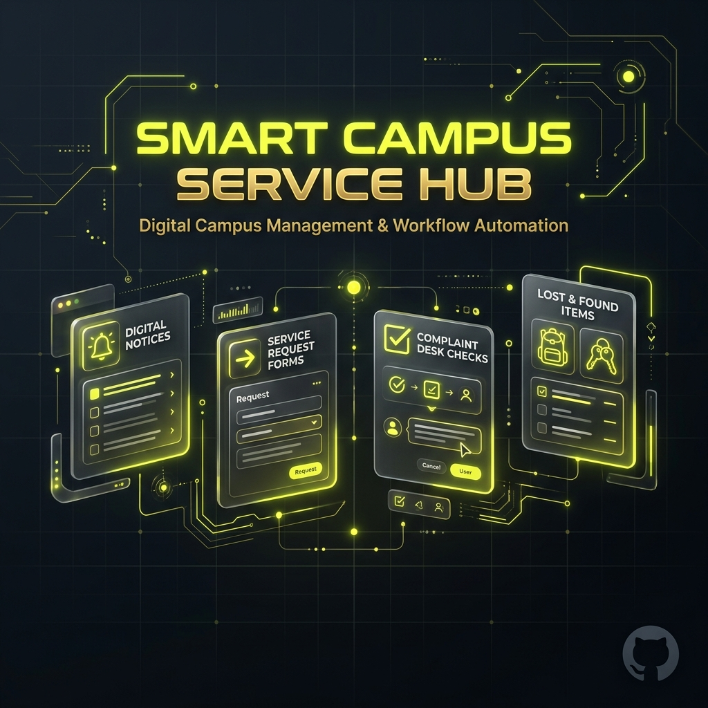
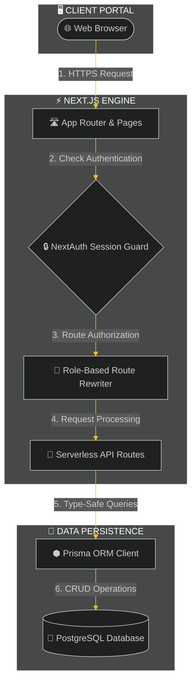

<div align="center">



<br /><br />

# Smart Campus Service Hub

### Digitizing Campus Operations through Secure, Role-Based, and Scalable Digital Workflows.
#### One Platform. Multiple Student Services. Zero Paperwork.

<br />

> **💡 Elevator Pitch:** Smart Campus Service Hub is a student-first portal that digitizes certificate requests, logs maintenance complaints, and automates lost-and-found claims under a single, role-based workflow.

An online portal for students to submit requests, report infrastructure issues, and track lost-and-found items.

<br />

<p align="center">
  <a href="https://smart-campus-servicehub.vercel.app" target="_blank">
    
  </a>&nbsp;&nbsp;
  <a href="https://youtu.be/2s7iWLVugc8" target="_blank">
    
  </a>&nbsp;&nbsp;
  <a href="https://github.com/gauravbuildz/smart-campus-service-hub" target="_blank">
    
  </a>
</p>

<br />

[](LICENSE)
[](https://github.com/gauravbuildz/smart-campus-service-hub/stargazers)
[](https://github.com/gauravbuildz/smart-campus-service-hub/network/members)
[](https://github.com/gauravbuildz/smart-campus-service-hub/commits/main)

<p align="center" style="margin-top: 8px;">
  
  
  
  
  
  
  
  
  
</p>

<br />

**🔐 Role-Based Access Control** &nbsp;&bull;&nbsp; **📢 Smart Notice Board** &nbsp;&bull;&nbsp; **🛠️ Complaint Management** &nbsp;&bull;&nbsp; **🎒 Lost & Found** &nbsp;&bull;&nbsp; **📊 Analytics Dashboard** &nbsp;&bull;&nbsp; **📱 Responsive Design** &nbsp;&bull;&nbsp; **⚡ Real-Time Updates**

</div>

---

<div align="center">

<a id="walkthrough"></a>


<p><i>Complete application walkthrough showing student and admin portals</i></p>

<p align="center">
  <a href="https://smart-campus-servicehub.vercel.app" target="_blank">
    
  </a>&nbsp;&nbsp;
  <a href="https://youtu.be/2s7iWLVugc8" target="_blank">
    
  </a>&nbsp;&nbsp;
  <a href="https://github.com/gauravbuildz/smart-campus-service-hub" target="_blank">
    
  </a>
</p>

</div>

---

## 📌 Table of Contents

- [About](#about)
- [Problem vs. Solution](#problem-vs-solution)
- [Core Features](#features)
- [Screenshot Gallery](#screenshots)
- [System Architecture](#architecture)
- [Tech Stack](#tech-stack)
- [Project Impact & Developer Insights](#impact-dev-insights)
- [Getting Started](#installation)
- [Technical Specifications](#technical-specifications)
- [Contributing](#contributing)
- [License](#license)
- [Developer](#developer)

---

<a id="about"></a>

## 📖 About

Smart Campus Service Hub is a production-grade, all-in-one digital portal designed to streamline everyday campus operations. Built to eliminate paper-based latency and fragmented notice boards, the application provides students with a self-service workspace to request academic credentials (certificates, transcripts), submit localized infrastructure maintenance complaints, and list lost-and-found items.

Administrators are equipped with a unified console to manage incoming student requests, triage maintenance tickets, verify lost asset claims, and broadcast global notice announcements to the campus.

---

<a id="problem-vs-solution"></a>

## 🔄 Problem vs. Solution

| Traditional Campus Bottlenecks | Smart Campus Service Hub Solutions |
| :--- | :--- |
| **📢 Scattered Announcements & Notices**<br>Official circulars, exam timelines, and schedules are scattered across physical boards or group chats, causing missed deadlines and outdated information. | **Centralized Urgency-Categorized Notice Board**<br>Provides a real-time announcement feed featuring urgency tags (High/Medium/Low), category filter groups, and automatic notice expiration rules to keep notices current. |
| **📄 Paper-Heavy Document Workflows**<br>Applying for simple certificates, transcript approvals, or ID cards requires printing paper forms, standing in physical queues, and chasing department signatures. | **Digital Self-Service Request Workflows**<br>Implements automated request paths where students upload document parameters and proof files, tracking progress end-to-end with status alerts. |
| **🛠️ Opaque & Untracked Campus Maintenance**<br>Physical infrastructure faults (broken lights, malfunctioning fixtures, offline routers) are reported verbally, leading to forgotten requests and zero accountability. | **Smart Complaint Manager & Audit Logs**<br>Enforces structured ticket logging with automatic severity scores, real-time coordinator status tracking, and permanent audit logs for repairs. |
| **🎒 Disorganized Handwritten Registers**<br>Lost item logs kept in handwritten paper registries are hard to search, leading to ownership disputes and administrative auditing delays. | **Verified Image-Proof Claims Engine**<br>Showcases a visual item gallery, requiring students to upload image proofs when claiming items, which automatically auto-rejects conflicting claims once verified. |

---

<a id="features"></a>

## ⚙️ Core Features

| Feature | Description | Key Operational Benefit |
| :--- | :--- | :--- |
| **🔒 NextAuth Authentication** | NextAuth-powered JSON Web Token (JWT) session security with bcryptjs cryptographic hashing. | Ensures bank-grade session security, absolute user account isolation, and robust credential protection. |
| **🎯 Granular Role-Based Access** | Dual-layer security enforcing client-side router locks and server-side middleware checks for distinct student/admin portals. | Prevents privilege escalation and restricts unauthorized entry to sensitive administration portals. |
| **🎓 Self-Service Student Portal** | Centralized dashboard for creating service requests, reporting complaints, claiming lost items, and downloading resources. | Empowers students with 24/7 self-service tools, drastically reducing manual administrative queues. |
| **💼 Unified Administrative Console** | Powerful management interface to audit complaints, approve lost item claims, update user records, and publish notice circulars. | Streamlines ticket triage, centralizes operational workflows, and improves institutional response times. |
| **📢 Dynamic Announcement System** | Categorized bulletin engine supporting priority tagging, rich media attachments, and automated post expiration. | Prevents communication silos, guarantees important notices are seen, and automates content archiving. |
| **🎒 Verified Claims Engine** | Image-proof validation system that automatically rejects duplicate reports once a valid claim is approved. | Eliminates fraudulent item collection, automates verification, and keeps campus logs audit-ready. |
| **🛠️ Smart Complaint Manager** | Multi-category ticket desk featuring automated urgency scoring, severity tags, and real-time coordinator status tracking. | Accelerates campus infrastructure maintenance by automatically routing issues according to urgency. |
| **📄 Centralized Resource Library** | Single repository for official campus handbooks, academic calendars, formatting guides, and institutional forms. | Drastically lowers redundant email inquiries and walk-in office traffic for standard campus documentation. |
| **📊 Interactive Analytics Engine** | Visual operational metrics showing real-time issue distributions, resolution rates, and audit logs. | Empowers management to identify recurring bottleneck areas and optimize resource allocation. |
| **🔔 Live Notification System** | User-specific notification panel delivering instant status updates, approval alerts, and campus announcements. | Keeps students immediately informed of ticket progress, removing manual follow-up loops. |
| **⚡ Digital Service Workflows** | Fully paperless application flows for certificates, transcripts, recommendation letters, and ID cards. | Eradicates slow manual paper routing and speeds up administrative verification times. |

---

<a id="screenshots"></a>

## 🖼️ Screenshot Gallery

<div align="center">

| | |
|:---:|:---:|
| <a href="screenshots/01-landing-page.png" target="_blank"></a><br><sub>**Landing Portal**<br>Institutional gateway with clean onboarding and quick action entrypoints</sub> | <a href="screenshots/02-login-page.png" target="_blank"></a><br><sub>**Secure Authentication**<br>Credential login page protected by NextAuth JWT sessions</sub> |
| <a href="screenshots/03-signup-page.png" target="_blank"></a><br><sub>**Student Registration**<br>Unified sign-up flow with instant input validation</sub> | <a href="screenshots/04-student-dashboard.png" target="_blank"></a><br><sub>**Student Workspace**<br>Self-service hub for resource access, notices, and tracking</sub> |
| <a href="screenshots/05-notices-event.png" target="_blank"></a><br><sub>**Dynamic Notice Board**<br>Categorized event listings and official announcements</sub> | <a href="screenshots/06-lost-found.png" target="_blank"></a><br><sub>**Lost & Found Marketplace**<br>Visual feed of lost items with image proof claim uploads</sub> |
| <a href="screenshots/07-resource-hub.png" target="_blank"></a><br><sub>**Shared Resource Hub**<br>Downloadable campus documents, handbooks, and schedules</sub> | <a href="screenshots/08-service-request.png" target="_blank"></a><br><sub>**Digital Service Requests**<br>Online document and certificate application form workflow</sub> |
| <a href="screenshots/09-student-profile.png" target="_blank"></a><br><sub>**Student Profile Management**<br>User settings and active session tracking</sub> | <a href="screenshots/10-admin-dashboard.png" target="_blank"></a><br><sub>**Admin Control Panel**<br>Unified queue for managing notice releases and complaints</sub> |
| <a href="screenshots/11-student-management.png" target="_blank"></a><br><sub>**Student Records Administration**<br>Admin tools to view, search, and manage registered students</sub> | <a href="screenshots/12-analytics-hub.png" target="_blank"></a><br><sub>**Operational Analytics Hub**<br>Visualized campus logs, resolution metrics, and activity charts</sub> |

</div>

---

<a id="architecture"></a>

## 🏗️ System Architecture

The application decouples client views and server operations, utilizing Next.js middleware routing to dynamically guide users.



---

<a id="tech-stack"></a>

## 🛠️ Tech Stack

| Category | Technology | Purpose | Version |
| :--- | :--- | :--- | :---: |
| **Frontend** | [Next.js](https://nextjs.org/) (App Router) | Client/Server rendering & optimized navigation | `16.2.6` |
| **Frontend** | [React](https://react.dev/) | Component-driven UI rendering and state management | `19.2.4` |
| **Frontend** | [Tailwind CSS](https://tailwindcss.com/) | Modern responsive utility-first CSS styling | `v4.0` |
| **Frontend** | [SWR](https://swr.vercel.app/) | High-speed cache syncing & optimistic client polling | `2.4.2` |
| **Frontend** | [Lucide React](https://lucide.dev/) | Sleek, modern vector icons for user interface | `0.469.0` |
| **Backend** | Serverless Routes | API endpoints routing and request validations | — |
| **Backend** | [UploadThing](https://uploadthing.com/) | Secure cloud media and file attachment storage | `7.7.4` |
| **Backend** | [bcryptjs](https://github.com/dcodeIO/bcrypt.js) | Salted, secure cryptographic password hashing | `3.0.3` |
| **Database** | [Prisma ORM](https://www.prisma.io/) | Type-safe schema definition and database queries | `5.18.0` |
| **Database** | [PostgreSQL](https://www.postgresql.org/) | Relational database storage engine | — |
| **Authentication** | [NextAuth.js](https://next-auth.js.org/) | Client/Server JWT session guard and authorization | `4.24.14` |
| **Deployment** | [Vercel](https://vercel.com/) | Serverless cloud hosting and deployment platform | — |
| **Developer Tools** | [TypeScript](https://www.typescriptlang.org/) | Static type safety and developer productivity | `5.x` |
| **Developer Tools** | [ESLint](https://eslint.org/) | Static code analysis and code quality linting | `9.x` |
| **Developer Tools** | [Prisma CLI](https://www.prisma.io/) | Database migration and client generator commands | `5.18.0` |
| **Developer Tools** | [ts-node](https://github.com/TypeStrong/ts-node) | TypeScript execution engine for database seeding | `10.9.2` |

---

<a id="impact-dev-insights"></a>

## 📈 Project Impact & Developer Insights

### Project Impact

| Stakeholder Segment | Operational Enhancement | Key Value Delivered |
| :--- | :--- | :--- |
| **🧑‍🎓 Student Body** | 24/7 digital access to certificate workflows, complaint submissions, and lost-and-found claims. | Saves hours of waiting in administrative queues, providing real-time ticket progress transparency. |
| **👩‍🏫 Academic Faculty** | Streamlined, instant digital notice publishing and institutional resource distribution. | Eliminates paper circulars and reduces classroom delays by keeping schedules up-to-date. |
| **👩‍💼 Campus Administration** | Automated ticket assignment, central queues management, and real-time operational analytics. | Accelerates resolution cycles, lowers back-office operational overhead, and simplifies auditing. |
| **🏫 Campus Ecosystem** | Complete elimination of paper trails and siloed communication channels. | Establishes a unified, eco-friendly, and transparent campus operation model. |

### Challenges Faced

- **Optimizing Role-Based Access Control (RBAC)**: Enforcing strict client-side layout guards and server-side route validation was a performance bottleneck. The solution was using NextAuth JWT session payload caching to check roles instantly on every routing step, avoiding redundant database lookups.
- **Dynamic Routing in Middleware**: Handling automatic role-based redirection within Next.js `middleware.ts` required precise token extraction. The routing middleware was structured to decrypt JWT tokens at the edge and seamlessly rewrite user routes (e.g. directing to Student vs Admin dashboards) without flickering.
- **Relational Schema Integrity in Prisma**: Structuring the database for interconnected workflows—like binding user reports, items, claims, and automatic status updates—was highly complex. A robust schema was mapped out with cascading actions to ensure claims reject automatically once an item is verified, keeping the database in a consistent state.
- **Responsive Design with Glassmorphism**: Blending glassmorphic design elements with fluid responsive layouts proved challenging. Custom media query setups were created to ensure desktop sidebars and mobile layout drawers transition smoothly without rendering issues or visual stuttering.

### Key Learnings

- **Server Component Architecture**: Gained experience balancing server components for performance-first data fetching and client components for interactive forms.
- **Session Customization**: Mastered extending NextAuth JWT tokens and session callbacks to propagate roles and database IDs securely across requests.
- **Relational Database Design**: Solidified understanding of Prisma migrations, schema relationships, and query optimization for relational databases.
- **Optimistic UI with SWR**: Implemented real-time polling and optimistic UI updates for notices and claims, creating a fast, snappy experience.

---

<a id="installation"></a>

## 🚀 Getting Started

Follow these steps to run the Smart Campus Service Hub locally on your system.

### Prerequisites

Ensure you have **Node.js** (v18.x or later) and **npm** installed on your machine.

---

### Step-by-Step Setup

#### 1. Clone the Repository

Begin by cloning the project directory and navigating to the root folder:

```bash
git clone https://github.com/gauravbuildz/smart-campus-service-hub.git
cd smart-campus-service-hub
```

#### 2. Configure Environment Variables

Create a new `.env` file in the root of the project:

```bash
# Copy placeholder keys
cp .env.example .env
```

Open the `.env` file and configure the variables according to the [Environment Variables](#environment-variables-reference) reference table below.

#### 3. Install Dependencies

Install the required npm packages:

```bash
npm install
```

#### 4. Initialize Database Schema

Generate the Prisma Client and sync the schema with your database:

```bash
npx prisma generate
npx prisma db push
```

#### 5. Seed Initial Data

Seed the database with sample administrators, students, resources, and notices:

```bash
npx prisma db seed
```

#### 6. Run the Development Server

Start the local Next.js server:

```bash
npm run dev
```

The application will now be running at [http://localhost:3000](http://localhost:3000).

---

### Environment Variables Reference

| Variable | Required | Description |
| :--- | :---: | :--- |
| `DATABASE_URL` | **Yes** | PostgreSQL connection string with connection pooling enabled. |
| `DIRECT_URL` | **Yes** | Direct PostgreSQL connection string bypassing the connection pooler. |
| `NEXTAUTH_SECRET` | **Yes** | Cryptographic secret key used to encrypt NextAuth JWT tokens. |
| `NEXTAUTH_URL` | **Yes** | The canonical base URL of the deployed application (e.g. `http://localhost:3000`). |
| `UPLOADTHING_TOKEN` | *No* | API token for UploadThing cloud media uploads (defaults to simulated local storage if omitted). |

---

### Demo Accounts & Credentials

For immediate testing, use the following pre-seeded test accounts:

| Portal | Email Address | Password |
| :--- | :--- | :--- |
| **🛡️ Administrator Workspace** | `admin@campus.edu` | `admin123` |
| **🎓 Student Workspace** | `student@campus.edu` | `student123` |

---

### Cloud Deployment (Vercel)

The platform is optimized for serverless environments. To deploy on Vercel:

1. **Push** your repository code to GitHub, GitLab, or Bitbucket.
2. **Connect** the repository to a new project in the [Vercel Dashboard](https://vercel.com).
3. **Configure** all the required environment variables to match your `.env` config.
4. **Deploy!** Vercel automatically detects the Next.js setup, runs build hooks, generates the Prisma Client, and deploys the application.

---

<a id="technical-specifications"></a>

## ⚙️ Technical Specifications

### Project Directory Structure

```text
smart-campus-service-hub/
├── prisma/                 # Database schema models, migrations & seed scripts
├── public/                 # Static assets and public resources
└── src/
    ├── app/                # Next.js App Router (pages, API routes, dashboards)
    ├── components/         # Reusable React components (UI & layout blocks)
    ├── lib/                # Shared utilities, Prisma client, NextAuth options
    └── middleware.ts       # Next.js request middleware for authentication & routing
```

### API Reference

All requests must include valid NextAuth session cookies (except public endpoints).

<details>
<summary>🔍 Click to Expand REST API Reference</summary>
<br />

| Endpoint | Method | Required Role | Description & Workflow |
| :--- | :--- | :--- | :--- |
| `/api/auth/register` | `POST` | Public | Registers a new student account and hashes credentials using bcryptjs. |
| `/api/students` | `GET`<br>`PUT`<br>`DELETE` | Admin | Fetches list of all students, updates student profiles, or deletes accounts. |
| `/api/notices` | `GET`<br>`POST`<br>`DELETE` | Public / Admin | Publicly lists campus notices or allows admins to publish and expire announcements. |
| `/api/issues` | `GET`<br>`POST`<br>`PATCH` | Student / Admin | Submits complaints (Student), fetches tickets, or updates resolutions and audit states. |
| `/api/lost-found` | `GET`<br>`POST`<br>`DELETE` | Student / Admin | Reports lost/found items with media, browses active listings, or deletes entries. |
| `/api/lost-found/claim` | `GET`<br>`POST`<br>`PATCH` | Student / Admin | Requests ownership of an item (Student) or reviews and approves claim proofs (Admin). |
| `/api/notifications` | `GET`<br>`PATCH` | Authenticated | Retrieves user-scoped real-time notifications or marks alert drawer items as read. |

</details>

### Security & Safeguards

- `🔒` **NextAuth JWT Management**: Manages user sessions via cryptographically signed client cookies.
- `🎯` **Role-Based Access (RBAC)**: Checks user roles before compiling pages or executing database queries.
- `🛡️` **Middleware Route Guard**: Intercepts requests to redirect unauthorized users away from restricted dashboard paths.
- `🔑` **Bcryptjs Hashing**: Hashes passwords securely on registration to protect student credentials.

### Performance Optimizations

- **Server-Side Data Fetching**: Utilizes Next.js Server Components to fetch initial metadata on the server, minimizing browser bundle size.
- **SWR Data Polling**: Uses client-side SWR hooks to serve cached data instantly while refreshing records in the background.
- **Prisma Client Caching**: Reuses a single, global database connection instance to prevent pool exhaustion.
- **Asset Pre-caching**: Leveraging Next.js automatic asset pre-fetching to enable near-instant route transitions.

### Future Enhancements

- [ ] **🤖 Smart AI Support Agent** — Integrate LLMs to analyze and automatically resolve standard campus FAQs.
- [ ] **🎫 Secure QR Code Claim Auditing** — Generate dynamic QR codes to verify owner identification at lost-and-found pick-up points.
- [ ] **🔔 Real-Time Web Push Notifications** — Deploy service workers for immediate browser alerts on notice releases and ticket status updates.
- [ ] **📅 Calendar Integrations** — Synchronize campus events, notices, and deadlines directly with Google Calendar and iCal.
- [ ] **📱 Native Mobile Application Wrapper** — Package the responsive web interface into a hybrid mobile app using Capacitor or Expo.

---

<a id="contributing"></a>

## 🤝 Contributing

1. Fork the project repository.
2. Create a clean topic branch (`git checkout -b feature/amazing-feature`).
3. Commit your changes (`git commit -m "feat: add some amazing feature"`).
4. Push to the branch (`git push origin feature/amazing-feature`).
5. Open a Pull Request.

---

<a id="license"></a>

## 📄 License

Distributed under the MIT License. See [LICENSE](LICENSE) for details.

---

<a id="developer"></a>

## 👨‍💻 Developer

<div align="center">

Designed and developed with ❤️ by **Gaurav Kumar**.

<p align="center">
  <a href="https://github.com/gauravbuildz" target="_blank"></a> &nbsp;&nbsp;
  <a href="https://www.linkedin.com/in/gauravbuildz/" target="_blank"></a> &nbsp;&nbsp;
  <a href="mailto:gauravbuildz@gmail.com" target="_blank"></a> &nbsp;&nbsp;
  <a href="https://github.com/gauravbuildz" target="_blank"></a>
</p>

━━━━━━━━━━━━━━━━━━━━━━━━━━━━━━━━━━━━━━

### Developed with ❤️ by **[Gaurav Kumar](https://github.com/gauravbuildz)**

**Built with:** Next.js &bull; React &bull; Prisma &bull; PostgreSQL

⭐ **Star this repository if you found it useful.**

Open Source • **[MIT License](LICENSE)**

━━━━━━━━━━━━━━━━━━━━━━━━━━━━━━━━━━━━━━

</div>
