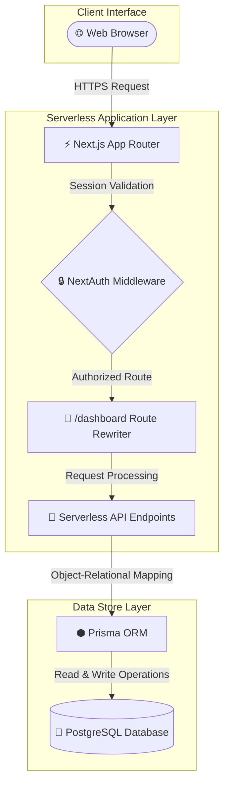

<div align="center">


<br />

# Smart Campus Service Hub

### *An online portal for students to submit requests, report infrastructure issues, and track lost-and-found items.*

> **💡 Elevator Pitch**: Smart Campus Service Hub is a student-first portal that digitizes certificate requests, logs maintenance complaints, and automates lost-and-found claims under a single, role-based workflow.

[](https://smart-campus-management-4rg6.vercel.app/)
[](https://www.youtube.com/watch?v=your-video-id)
[](https://github.com/gaurav-spnrec/smart-campus-management-1.git)
[](LICENSE)

[](https://github.com/gaurav-spnrec/smart-campus-management-1/stargazers)
[](https://github.com/gaurav-spnrec/smart-campus-management-1/network/members)
[](https://github.com/gaurav-spnrec/smart-campus-management-1/commits/main)

<br />

<p align="center">
  
  
  
  
  
  
  
  
  
</p>

</div>

---

<div align="center">

<a id="walkthrough"></a>

<p><i>Complete application walkthrough showing student and admin portals</i></p>

</div>

---

## Table of Contents

- [About](#about)
- [Problem vs. Solution](#problem-vs-solution)
- [Core Features](#features)
- [Screenshots](#screenshots)
- [Architecture](#architecture)
- [Tech Stack](#tech-stack)
- [Impact & Dev Insights](#impact-dev-insights)
- [Setup Guide](#installation)
- [Developer](#developer)

---

<a id="about"></a>
## About

This portal is built to handle everyday campus tasks online. It gives students a single place to apply for documents (like certificates or ID cards), report physical maintenance issues (like broken lights or classroom problems), and post lost-and-found items. Administrators can log in to view the queue of requests, update their status, and broadcast notices to the student body.

---

<a id="problem-vs-solution"></a>
## Problem vs. Solution

| Traditional Campus Bottlenecks | Smart Campus Service Hub Solutions |
| :--- | :--- |
| **📢 Scattered Notices**<br>Circulars posted on physical boards or informal chat groups lead to missed deadlines and outdated details. | **Centralized Notice Board**<br>Priority-tagged circular feed with automated post expiration filters to keep announcements current. |
| **📄 Paper-Heavy Forms**<br>Applying for documents (certificates, transcript IDs) requires physical paperwork, signatures, and office queues. | **Digital Service Requests**<br>Secure online request workflows where students apply, upload details, and track progress. |
| **🛠️ Opaque Maintenance Logs**<br>Infrastructure bugs (broken class lights, offline routers) are verbalized and forgotten without tracking. | **Interactive Complaint Desk**<br>Auditable logs tracking ticket resolution paths, severity priorities, and coordinator status logs. |
| **🎒 Hard-to-Search Registers**<br>Lost and found records kept in handwritten ledger books lead to collection disputes and audit delays. | **Verified Claims Engine**<br>Visual item gallery requiring claim proofs. Approving a claim automatically rejects duplicate reports. |

---

<a id="features"></a>
## Core Features

| Feature | Description | Business/Operational Benefit |
| :--- | :--- | :--- |
| **🔒 Secure Authentication** | NextAuth JWT-based session security with bcryptjs password hashing. | Guarantees account isolation and protects personal records. |
| **🎯 Role-Based Access (RBAC)** | Strict client-side router and server-side middleware validation. | Restricts administrative operations and dashboards to validated admins. |
| **🧑‍🎓 Student Workspace** | Clean portal for submitting tickets, tracking claims, and downloading resources. | Empowers students with self-service features, removing administrative queues. |
| **👩‍💼 Admin Panel** | Unified panel to review tickets, approve claims, and manage student details. | Centralizes triage workflows and reduces administrative response times. |
| **📢 Dynamic Notice Board** | Category-tagged circulars with attachment options and automatic post expiration. | Prevents communications fragmentation and keeps details up to date. |
| **🎒 Verified Lost & Found** | Claim verification engine requiring image proof uploads. | Automates lost asset claims and prevents duplicate/fraudulent collection. |
| **🛠️ Complaint Desk** | Categorized ticket manager with automated priority assignment. | Accelerates infrastructure repairs by organizing tasks by urgency. |
| **📄 Shared Resource Hub** | Centralized directory for college handbooks, guides, and schedules. | Minimizes in-office inquiries for standard campus documentation. |
| **📊 Analytics Dashboard** | Visual charts showing ticket status distributions and audit graphs. | Helps administration identify infrastructure bottlenecks and audit workloads. |
| **🔔 Alert Notification Drawer** | User-scoped notification center updating on ticket status changes. | Informs students instantly when tickets are resolved or approved. |
| **⚡ Service Request Engine** | Digital application forms for certificates, documents, and credentials. | Eliminates paper forms and standardizes application review workflows. |

---

<a id="screenshots"></a>
## Screenshots

<div align="center">

|  |  |
| :---: | :---: |
| **Landing Portal** | **Student Workspace** |
|  |  |
| **Notice Board** | **Shared Resource Hub** |
|  |  |
| **Admin Control Panel** | **Operational Analytics** |

</div>

---

<a id="architecture"></a>
## System Architecture

The application decouples client views and server operations, utilizing Next.js middleware routing to dynamically guide users.



---

<a id="tech-stack"></a>
## Tech Stack

| Category | Technology | Purpose | Version |
| :--- | :--- | :--- | :---: |
| **Frontend** | Next.js (App Router) | Client/Server rendering and navigation | `16.2.6` |
| **Frontend** | React | Component state life cycles and view logic | `19.2.4` |
| **Frontend** | Tailwind CSS | Responsive UI styling and theme management | `v4.0` |
| **Frontend** | SWR | High-speed cache syncing and polling hooks | `2.4.2` |
| **Backend** | Serverless Routes | API handlers and request validation | - |
| **Backend** | UploadThing | Secure attachment and image storage integrations | `7.7.4` |
| **Database** | Prisma | Schema modeling and type-safe query builder | `5.18.0` |
| **Database** | PostgreSQL | Relational database engine | - |
| **Authentication** | NextAuth | User credentials session verification | `4.24.14` |
| **Deployment** | Vercel | Production cloud deployment hosting | - |

---

<a id="impact-dev-insights"></a>
## Project Impact & Dev Insights

### Project Impact

| Segment | Operational Impact | Value Delivered |
| :--- | :--- | :--- |
| **🧑‍🎓 Students** | Real-time tracking and 24/7 self-service portal. | Saves hours of queuing and provides absolute clarity on ticket updates. |
| **👩‍🏫 Faculty & Staff** | Streamlined notice publishing and resource distribution. | Reduces administrative distraction and classrooms setup delays. |
| **👩‍💼 Administration** | Automated routing, analytics charts, and unified queues. | Lowers overhead, speeds up resolution loops, and improves auditing. |
| **🏫 Campus Digitization** | Elimination of paper trails and siloed communication channels. | Establishes a modern, sustainable, and transparent campus environment. |

### Challenges Faced

- **RBAC & Next.js App Router**: Implementing secure role-based access checks at both the client layout level and server API routes without introducing redundant session lookups.
- **Middleware Role Routing**: Intercepting requests inside `middleware.ts` to redirect authenticated users to their correct student/admin dashboard route based on user roles embedded inside JWT tokens.
- **Prisma Relational Database Design**: Modeling database relationships for complex workflows (such as mapping claims to lost item listings and author accounts) while preserving integrity constraints.
- **Responsive Glassmorphic UI**: Balancing glassmorphic visual aesthetics with clean responsive design across both desktop sidebars and mobile drawers.

### Learnings

- **Next.js App Router & Server Components**: Understood how server components improve initial load times and how to balance them with client components for interactive forms.
- **NextAuth Session Integration**: Learned to customize the NextAuth JWT and session callbacks to persist custom user attributes (like database IDs and roles) across requests.
- **Prisma & Relational Modeling**: Mastered schema design, migration execution, and how to write efficient raw database queries via Prisma Client.
- **Client-Side Caching with SWR**: Leveraged SWR to fetch dynamic notice feeds, implementing automatic revalidation and local optimistic cache updates for rapid feedback.

---

<a id="installation"></a>
## Setup Guide

### 1. Clone the Project
```bash
git clone https://github.com/gaurav-spnrec/smart-campus-management-1.git
cd smart-campus-management-1
```

### 2. Configure Environment
Create a `.env` file in the root directory (see [Environment Variables](#environment-variables)).

### 3. Install Dependencies
```bash
npm install
```

### 4. Push Database Schema
```bash
npx prisma generate
npx prisma db push
```

### 5. Seed Initial Data
```bash
npx prisma db seed
```

### 6. Launch Local Server
```bash
npm run dev
```
Open [http://localhost:3000](http://localhost:3000) to view the application.

### Environment Variables

| Variable | Required | Description |
| :--- | :---: | :--- |
| `DATABASE_URL` | Yes | PostgreSQL connection string with pooling properties |
| `DIRECT_URL` | Yes | Direct PostgreSQL connection string without poolers |
| `NEXTAUTH_SECRET` | Yes | Custom secret key for JWT hashes encryption |
| `NEXTAUTH_URL` | Yes | Base canonical URL of the application site |
| `UPLOADTHING_TOKEN`| No | Token for asset cloud upload (defaults to simulated mock) |

### Demo Credentials

For testing the application locally or checking deployment, use the following accounts:

- **Administrator Portal**
  - **Email**: `admin@campus.edu`
  - **Password**: `admin123`
- **Student Portal**
  - **Email**: `student@campus.edu`
  - **Password**: `student123`

### Deployment

The platform is designed to be fully serverless-ready and can be deployed in minutes on Vercel:

1. **Push your code** to a GitHub repository.
2. **Import the repository** into Vercel.
3. **Configure Environment Variables** in Vercel to match your `.env` values.
4. **Deploy!** Vercel will automatically build and run migrations during the build phase via `npm run build`.

---

## Technical Specifications

### Folder Structure

```text
smart-campus-management/
├── prisma/                 # Database schema models & seed scripts
├── public/                 # Static assets & public resources
└── src/
    ├── app/                # App Router folder (API & Dashboard views)
    ├── components/         # Reusable client & server UI components
    ├── lib/                # Database config & NextAuth callbacks
    └── middleware.ts       # Route guard middleware
```

### API Reference

All routes except authentication callback require valid NextAuth cookies.

<details>
<summary>View API Endpoints</summary>

| Endpoint | Method | Role | Purpose |
| :--- | :--- | :--- | :--- |
| `/api/auth/register` | `POST` | Public | Student signup callback |
| `/api/students` | `GET`/`PUT`/`DELETE` | Admin | Student user database operations |
| `/api/notices` | `GET`/`POST`/`DELETE` | User/Admin | Notice board events creation & listings |
| `/api/issues` | `GET`/`POST`/`PATCH` | Student/Admin | Raise complaints and log workflow audits |
| `/api/lost-found` | `GET`/`POST`/`DELETE` | User/Admin | List, report, and delete lost/found items |
| `/api/lost-found/claim`| `GET`/`POST`/`PATCH` | Student/Admin | Manage item claims ownership workflows |
| `/api/notifications` | `GET`/`PATCH` | Authorized | Read status drawer notifications in inbox |

</details>

### Security

- `🔒` **NextAuth JWT Management**: Manages user sessions via cryptographically signed client cookies.
- `🎯` **Role-Based Access (RBAC)**: Checks user roles before compiling pages or executing database queries.
- `🛡️` **Middleware Route Guard**: Intercepts requests to redirect unauthorized users away from restricted dashboard paths.
- `🔑` **Bcryptjs Password Hashing**: Hashes passwords on user registration to safeguard accounts.

### Performance

- **Server Components**: Reduces browser bundle size by fetching metadata on the server.
- **SWR Data Query Hooks**: Serves cached data instantly while refreshing records in the background.
- **Prisma Global Client Cache**: Reuses database connection handles to prevent execution pool exhaustion.
- **Asset Pre-caching**: Caches page files and assets locally to minimize latency.

### Future Enhancements

- [ ] **🤖 AI Assistant Integration** — LLM assistant to resolve FAQ tickets.
- [ ] **🎫 QR Code Claim Auditing** — Instant QR codes to verify lost item collections.
- [ ] **🔔 Web Push Notifications** — Immediate notification push on notice releases.
- [ ] **📅 Campus Calendar Synchronization** — Sync academic timelines to external calendars.
- [ ] **📱 Native App Wrapper** — Package layouts inside native mobile wrappers.

---

## Contributing

1. Fork the project repository.
2. Create a clean topic branch (`git checkout -b feature/amazing-feature`).
3. Commit your changes (`git commit -m "feat: add some amazing feature"`).
4. Push to the branch (`git push origin feature/amazing-feature`).
5. Open a Pull Request.

---

## License

Distributed under the MIT License. See `LICENSE` for details.

---

<a id="developer"></a>
## Developer

<div align="center">

Designed and developed with ❤️ by **Gaurav Kumar**.

<p align="center">
  <a href="https://github.com/gaurav-spnrec"></a>
  <a href="https://www.linkedin.com/in/gauravbuildz/"></a>
</p>

━━━━━━━━━━━━━━━━━━━━━━━━━━━━━━━━━━━━━━

Built with ❤️ using Next.js • React • Prisma • PostgreSQL

⭐ If this project helped you, consider giving it a Star.

━━━━━━━━━━━━━━━━━━━━━━━━━━━━━━━━━━━━━━

</div>
