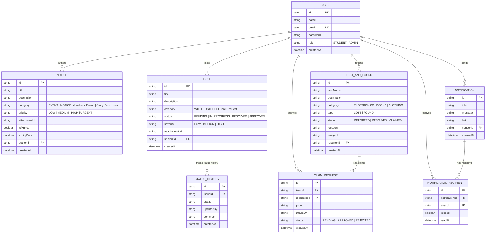
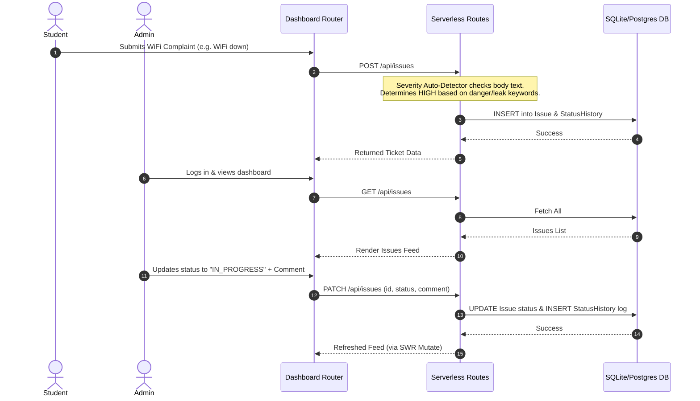

<div align="center">

# 🎓 Smart Campus Service Hub

### *A premium, centralized digital ecosystem modernizing student services, operations, and campus operations.*

<p align="center">
  <a href="https://smart-campus-management-4rg6.vercel.app/"><strong>🚀 Experience Live Demo »</strong></a>
</p>

[](https://nextjs.org/)
[](https://react.dev/)
[](https://tailwindcss.com/)
[](https://www.prisma.io/)
[](https://next-auth.js.org/)
[](LICENSE)

---

</div>

## 📌 Table of Contents
1. [Project Overview](#-project-overview)
2. [Live Demo & Repository](#-live-demo--repository)
3. [Key Features](#-key-features)
4. [Technology Stack](#-technology-stack)
5. [Folder Structure](#-folder-structure)
6. [System Architecture](#-system-architecture)
7. [Authentication & Authorization Flow](#-authentication--authorization-flow)
8. [Database Architecture & ERD](#-database-architecture--erd)
9. [Application Lifecycle](#-application-lifecycle)
10. [Feature Modules Walkthrough](#-feature-modules-walkthrough)
11. [API Endpoint Directory](#-api-endpoint-directory)
12. [Installation & Setup](#-installation--setup)
13. [Environment Configuration](#-environment-configuration)
14. [Design & Layout Specs](#-design--layout-specs)
15. [Performance & Security Metrics](#-performance--security-metrics)
16. [Interface Preview](#-interface-preview)
17. [Future Enhancements](#-future-enhancements)
18. [Contributing](#-contributing)
19. [License & Acknowledgments](#-license--acknowledgments)

---

## 💡 Project Overview

In traditional educational institutions, campus operations are plagued by fragmented communication, offline forms, manual workflows, and disconnected portals. 
**Smart Campus Service Hub** solves these pain points by offering a modern, unified, role-based platform that centralizes notices, streamlines issue reporting, hosts digital document downloads, manages service applications, and coordinates lost-and-found requests inside a single real-time dashboard.

### Target Users
*   **Students:** Apply for services (ID cards, Bonafide certificates, etc.), file complaints (WiFi, Classrooms, Hostels), claim lost items, and receive notifications immediately.
*   **Administrators:** Broadcast campus-wide notices, review and change ticket statuses, register or update student data, publish academic materials, and inspect campus analytics.

### Key Benefits
*   **Centralized Source of Truth:** Eliminates messy chat groups and physical notice boards.
*   **Accelerated Resolutions:** Real-time logging of issues with status history audits.
*   **Offline Fallback Adaptability:** Fully functional file upload dropzone with a simulated local preview when UPLOADTHING keys are omitted.

---

## 🔗 Live Demo & Repository

*   **Production Deployment:** [https://smart-campus-management-4rg6.vercel.app/](https://smart-campus-management-4rg6.vercel.app/)
*   **Source Code Repository:** [https://github.com/gaurav-spnrec/smart-campus-management-1.git](https://github.com/gaurav-spnrec/smart-campus-management-1.git)

---

## ✨ Key Features

*   **🛡️ Secure Role-Based Access:** Automatic dashboard access control via NextAuth middleware mapping permissions dynamically to either `STUDENT` or `ADMIN`.
*   **🛠️ Complaints Hub:** File campus infrastructure, classroom, or housing issues. Includes a smart keyword-based **Auto-Severity Detector** that highlights critical complaints (e.g. fire, shock, danger) as `HIGH` severity and routine alerts (e.g. slow, dusty) as `LOW` severity.
*   **📢 Notices & Announcements Board:** Broadcaster panel with categorizations (`GENERAL`, `EXAM`, `EVENT`, `CIRCULAR`), expiration parameters, attachments, and pinned notifications.
*   **🎒 Lost & Found Hub:** Secure reporter tracking with image proofs. Allows students to log items and submit verified ownership claims.
*   **📄 Resource & Form Center:** Document library containing academic syllabus templates, student guidelines, timetables, and download forms.
*   **🪪 Service Requests Desk:** Apply for Bonafide certificates, parking passes, hostel checks, library registration, or grade sheets.
*   **📊 Campus Analytics Engine:** Admin panel featuring real-time distribution charts, open issue stats, notification logs, and user records.
*   **🔔 Real-Time Notification Recipient Matrix:** Push system logging notices, claims notifications, and admin approvals inside a clean inbox drawer.

---

## 💻 Technology Stack

| Layer | Technology | Version | Purpose |
| :--- | :--- | :--- | :--- |
| **Frontend Framework** | Next.js (App Router) | `16.2.6` | Client/Server Rendering, API Handlers |
| **UI Library** | React | `19.2.4` | Component State Lifecycle & Interactive Views |
| **Styling Engine** | Tailwind CSS | `v4.0` | Modern, responsive grid layouts and variables |
| **Database Engine** | SQLite (Local) / PostgreSQL | (Neon Cloud) | Persistent database records storage |
| **Database ORM** | Prisma Client | `5.18.0` | Schema definitions and type-safe query generation |
| **Authentication** | NextAuth.js | `4.24.14` | Secure CredentialsProvider JWT session management |
| **Client Fetching** | SWR | `2.4.2` | High-frequency polling data cache synchronization |
| **Upload Service** | UploadThing | `7.7.4` | Cloud image upload handler & mock fallback |
| **Icons Library** | Lucide React | `0.469.0` | Unified modern icons set |
| **Security Layer** | bcryptjs | `3.0.3` | Multi-round database password hashing |

---

## 📂 Folder Structure

```
smart-campus-management/
├── prisma/
│   ├── dev.db                 # SQLite database storage (development)
│   ├── schema.prisma          # Prisma data schemas & relational models
│   └── seed.ts                # Seeding script for mock users & logs
├── public/                    # Static asset catalog
├── src/
│   ├── app/
│   │   ├── api/               # Serverless API routes
│   │   │   ├── auth/          # Credentials sign-in & sign-up endpoints
│   │   │   ├── issues/        # Ticket & request logic controllers
│   │   │   ├── lost-found/    # Items & ownership claims management
│   │   │   ├── notices/       # Broadcast announcements & resource uploads
│   │   │   ├── notifications/ # User specific inbox notification handles
│   │   │   ├── students/      # Admin student CRUD actions
│   │   │   └── uploadthing/   # Upload file router configurations
│   │   ├── dashboard/         # Main layout & role-mapped panels
│   │   │   ├── analytics/     # Admin-only KPI dashboards
│   │   │   ├── issues/        # Infrastructure complaints tracker
│   │   │   ├── lost-found/    # Reported items feed & claims sub-flow
│   │   │   ├── notices/       # Announcement feeds & pinned notice items
│   │   │   ├── profile/       # User profile details and stats dashboard
│   │   │   ├── requests/      # ID cards, certificates, & hostel applications
│   │   │   ├── resources/     # Forms & downloads storage center
│   │   │   ├── settings/      # Profile actions & passwords change panel
│   │   │   └── students/      # Admin-only user control list
│   │   ├── layout.tsx         # Global wrap context Providers
│   │   └── page.tsx           # Entry controller & role router redirect
│   ├── components/
│   │   ├── DashboardHero.tsx  # Dynamic dashboard section headers
│   │   ├── LandingPageClient.tsx # Home page modals & animations client
│   │   ├── Providers.tsx      # NextAuth session propagation container
│   │   └── Toast.tsx          # Client warning/success toasts helper
│   ├── lib/
│   │   ├── auth.ts            # NextAuth Credentials configuration mapping
│   │   ├── db.ts              # Global cached PrismaClient initializer
│   │   └── uploadthing.tsx    # Upload dropzone component with mock preview
│   └── middleware.ts          # Server-side auth route checks
├── .env                       # Environment variables config
├── eslint.config.mjs          # Linting presets
├── next.config.ts             # Rewrite proxy paths and server packaging configurations
├── package.json               # Package dependencies & commands
├── postcss.config.mjs         # Tailwind processor properties
└── tsconfig.json              # TypeScript compilation attributes
```

---

## ⚙️ System Architecture

The application implements a decoupled App Router structure using Next.js route rewrites for client pathways. Both `/admin/dashboard` and `/student/dashboard` are rewritten to `/dashboard`, which resolves dynamically based on the session role.

```mermaid
graph TD
    User([User Browser]) -->|Request URL| MW[src/middleware.ts]
    MW -->|Guest / Not Auth| RedirectHome[Redirect to /?login=true]
    MW -->|Auth Session Check| RW{next.config.ts Rewrites}
    
    RW -->|/admin/dashboard| RouteDashboard[/dashboard]
    RW -->|/student/dashboard| RouteDashboard
    
    RouteDashboard --> Layout[src/app/dashboard/layout.tsx]
    Layout --> PageRenderer[src/app/dashboard/page.tsx]
    
    PageRenderer -->|Role: STUDENT| StudentView[Student Dashboard Widgets]
    PageRenderer -->|Role: ADMIN| AdminView[Admin Dashboard Widgets]
    
    StudentView & AdminView -->|API Fetch / Poll| SWR[SWR Client-Side Hooks]
    SWR -->|Requests| APILayer[src/app/api/* Routing Layer]
    
    APILayer -->|Queries| Prisma[Prisma ORM Client]
    Prisma -->|Read/Write| DB[(SQLite / PostgreSQL Database)]
```

---

## 🔐 Authentication & Authorization Flow

1.  **Authentication:** Users enter credentials at the Landing Page modals which calls the `CredentialsProvider` defined in `src/lib/auth.ts`.
2.  **Password Hashing:** Verified using `bcryptjs` comparing database password hashes.
3.  **Session Middleware:** Token states are mapped inside the JWT callback. `src/middleware.ts` intercepts `/dashboard/:path*`, `/admin/dashboard/:path*`, and `/student/dashboard/:path*`.
4.  **Role Authorization:** A user role is determined from their session profile (`STUDENT` or `ADMIN`).
5.  **Route Protection:** The middleware automatically redirects students requesting admin routes to `/student/dashboard` and keeps authenticated sessions away from landing pages.

---

## 🗄️ Database Architecture & ERD

The data layer uses Prisma schemas mapping user relationships across alerts, issues, history tables, items, and inboxes.



---

## 🔄 Application Lifecycle



---

## 🧩 Feature Modules Walkthrough

<details>
<summary><b>🛠 Complaints Hub Workflow</b></summary>

*   **Purpose:** Report and resolve campus infrastructure issues.
*   **Student Actions:** Enter a title, description, category, and an image attachment. SWR registers the complaint, auto-calculates severity levels via keyword matching, and appends a `PENDING` status.
*   **Admin Actions:** Review the complaint timeline, update status to `IN_PROGRESS` or `RESOLVED`, adjust priority severity levels, and append feedback logs which display directly in the student's ticket history.
</details>

<details>
<summary><b>🎒 Lost & Found Module</b></summary>

*   **Purpose:** Coordinate search and return pipelines for lost belongings.
*   **Student Actions:** Post items (`LOST` or `FOUND`) with locations and details. Submit an ownership claim on a found item, uploading an image proof of ownership.
*   **Admin Actions:** Review pending claims on items, approve or reject them. Approving automatically rejects all other overlapping pending claims on the same item, updating the item status to `CLAIMED`, and pushes an inbox alert to the student.
</details>

<details>
<summary><b>📄 Resource Hub & Service Requests</b></summary>

*   **Purpose:** Centralize academic materials and document application workflows.
*   **Resource Hub Workflow:** Admins publish forms (Syllabus files, college guidelines). To preserve structural uniformity, these documents are stored in the `Notice` model, with file sizes and type tags serialized into JSON descriptions.
*   **Service Desk Workflow:** Students apply for ID cards, hostel checkouts, or parking passes. These requests leverage the `Issue` model, keeping applications separate from infrastructure complaints.
</details>

---

## 📡 API Endpoint Directory

All endpoints are protected and verify active NextAuth session tokens prior to execution.

### Authentication & Students
| Method | Endpoint | Access | Purpose |
| :--- | :--- | :--- | :--- |
| `POST` | `/api/auth/register` | Public | Register new credentials, default role to `STUDENT` |
| `GET` | `/api/students` | Admin | Fetch all registered student and admin records |
| `PUT` | `/api/students` | Admin | Update student profile details (name, email, role, password) |
| `DELETE` | `/api/students` | Admin | Delete a user profile (prevents self-deletion) |

### Notices & Announcements
| Method | Endpoint | Access | Purpose |
| :--- | :--- | :--- | :--- |
| `GET` | `/api/notices` | Authorized | Fetch unexpired notices sorted by pinned priorities |
| `POST` | `/api/notices` | Admin | Create a new notice or Resource Hub document. Automatically broadcasts alert inboxes to all other students |
| `DELETE` | `/api/notices` | Admin | Delete notice/document |

### Issues & Service Requests
| Method | Endpoint | Access | Purpose |
| :--- | :--- | :--- | :--- |
| `GET` | `/api/issues` | Authorized | Student gets own issues; Admin gets all campus complaints/requests |
| `POST` | `/api/issues` | Student | Raise complaint or service request. Auto-sets severity tags |
| `PATCH` | `/api/issues` | Admin | Update issue status/severity, write comments, append logs |

### Lost & Found
| Method | Endpoint | Access | Purpose |
| :--- | :--- | :--- | :--- |
| `GET` | `/api/lost-found` | Authorized | Fetch list of all lost/found items |
| `POST` | `/api/lost-found` | Student | Report lost or found items |
| `DELETE` | `/api/lost-found` | Authorized | Delete report (allowed for reporter or Admins) |
| `GET` | `/api/lost-found/claim` | Authorized | Fetch claim requests (Student: own claims; Admin: all claims) |
| `POST` | `/api/lost-found/claim` | Student | Apply ownership claim request, alert item reporter & admin |
| `PATCH` | `/api/lost-found/claim` | Admin | Approve/Reject claim request, resolve item state, update inbox alerts |

### Notifications Inbox
| Method | Endpoint | Access | Purpose |
| :--- | :--- | :--- | :--- |
| `GET` | `/api/notifications` | Authorized | Fetch top 20 notifications for the authenticated user |
| `PATCH` | `/api/notifications` | Authorized | Mark a single notification or all notifications as read |

---

## 🚀 Installation & Setup

Follow these steps to configure and run the application locally.

### Prerequisites
*   Node.js (v18.x or later)
*   npm or yarn

### 1. Clone the Repository
```bash
git clone https://github.com/gaurav-spnrec/smart-campus-management-1.git
cd smart-campus-management-1
```

### 2. Install Project Dependencies
```bash
npm install
```

### 3. Initialize Database Schemas
Generate the type-safe client maps and push schema configurations directly to your local database:
```bash
npx prisma generate
npx prisma db push
```

### 4. Seed Mock Data
Populate the database with sample notices, tickets, lost & found items, and default profiles:
```bash
npx prisma db seed
```

### 5. Start Development Server
```bash
npm run dev
```
Open [http://localhost:3000](http://localhost:3000) to view the application.

---

## 📝 Environment Configuration

Create a `.env` file in the project root directory.

```properties
# Prisma Database Connections (Configured for SQLite locally or PostgreSQL in production)
DATABASE_URL="file:./dev.db"

# NextAuth Configurations
NEXTAUTH_SECRET="super-secret-campus-key-12345"
NEXTAUTH_URL="http://localhost:3000"

# Optional Cloud File Upload Integrations (Mock upload is active if missing)
# UPLOADTHING_TOKEN="YOUR_UPLOADTHING_API_TOKEN"
```

### 👤 Local Testing Accounts
If you run the seeding script (`npm run db seed`), you can log in using these default credentials:

*   **Administrator Account:**
    *   **Email:** `admin@campus.edu`
    *   **Password:** `admin123`
*   **Student Account:**
    *   **Email:** `student@campus.edu`
    *   **Password:** `student123`

---

## 🎨 Design & Layout Specs

*   **Glassmorphic Accents:** Uses deep colors, subtle border shadows (`border-slate-200/60`), and backdrop-blur backings to create high-end visual cards.
*   **Adaptive Theme Gradients:** Dashboard sections feature color themes (e.g. Complaints use Rose gradients, Notices fuchsia violet, and Analytics emerald greens).
*   **Fully Responsive Breakpoints:**
    *   **Desktop/Laptop:** Expanded sidebar navigation menus.
    *   **Tablet/Mobile:** Collapses sidebar panels into drawer menus toggled using hamburger bars. Stack tables and cards to ensure readability.

---

## 📈 Performance & Security Metrics

*   **Optimized Client Fetching (SWR):** Utilizes `swr` caches for client queries. Features dynamic background polling intervals (refresh every 5 seconds) to ensure real-time campus data updates without full page reloads.
*   **Robust Connection Pools:** The Prisma Client client-wrapper (`src/lib/db.ts`) preserves connection instances in hot-reloading development environments to avoid sqlite/postgresql database socket leaks.
*   **Middleware Route Guards:** No client layouts load unless sessions exist. Unauthorized pages are caught and redirected.
*   **Sanitized Data Inputs:** Role switches and registration formats are checked server-side to prevent privilege escalation.

---

## 🖼️ Interface Preview

Below are the mock outlines of standard interface views:

| View Page | Description | Outline Representation |
| :--- | :--- | :--- |
| **Landing & Auth Gateway** | Main entry hub displaying info cards, FAQ accordions, and registration login portals. | `[ Hero Section ]` <br/> `[ Login / Sign Up Forms ]` |
| **Student Dashboard** | Live grid cards showing active complaints, notification counters, and recent notices. | `[ Notice Board ] [ Action Widgets ]` <br/> `[ My Complaints Logs ] [ Active Claims ]` |
| **Admin Operations** | Manage students, adjust complaint resolutions, issue announcements, and review analytics. | `[ Analytics Charts ] [ Manage Students ]` <br/> `[ Complaints Control Panel ]` |

---

## 🔮 Future Enhancements

*   **💬 Live Support Chat:** Integrated socket logs between students and desk administrators.
*   **📅 Event Calendar Feed:** Direct calendar integrations mapping to academic exams, events, and deadlines.
*   **🤖 AI Support Assistant:** Automated chatbot that fields basic FAQs about college procedures, form queries, and hostel bookings.

---

## 🤝 Contributing

Contributions are welcome! Please follow these steps to contribute:

1. Fork the Project Repository.
2. Create your Feature Branch (`git checkout -b feature/AmazingFeature`).
3. Commit your changes (`git commit -m 'Add some AmazingFeature'`).
4. Push to the Branch (`git push origin feature/AmazingFeature`).
5. Open a Pull Request.

---

## 📄 License & Acknowledgments

*   Distributed under the MIT License. See `LICENSE` for more information.
*   **Acknowledgments:** Built with components by Tailwind CSS, Lucide icons, and the NextAuth community. Created for next-generation campus automation.

---

<div align="center">
  <b>Developed with ❤️ for Smart Campus Ecosystems</b>
</div>
