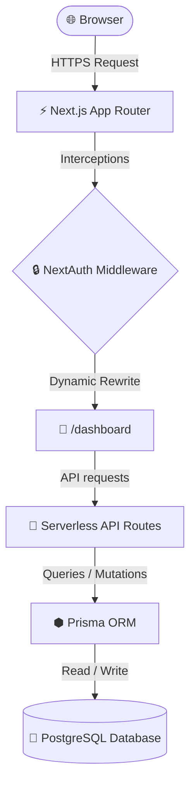
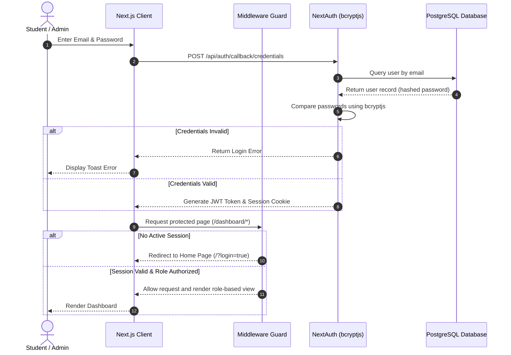

<div align="center">

# 🎓 Smart Campus Service Hub

### *A Premium, Centralized Web Ecosystem Modernizing Student Services & Campus Operations*

[](https://smart-campus-management-4rg6.vercel.app/)
[](https://github.com/gaurav-spnrec/smart-campus-management-1.git)
[](LICENSE)

[](https://github.com/gaurav-spnrec/smart-campus-management-1/stargazers)
[](https://github.com/gaurav-spnrec/smart-campus-management-1/network/members)
[](https://github.com/gaurav-spnrec/smart-campus-management-1/issues)
[](https://github.com/gaurav-spnrec/smart-campus-management-1/graphs/contributors)
[](https://github.com/gaurav-spnrec/smart-campus-management-1/commits/main)

<p align="center">
  
  
  
  
  
  
  
  
  
</p>

---

</div>

## 📌 Table of Contents

- [About Project](#-about-project)
- [Problem Statement](#-problem-statement)
- [Proposed Solution](#-proposed-solution)
- [Key Features](#-key-features)
- [Screenshots](#-screenshots)
- [Technology Stack](#-technology-stack)
- [System Architecture](#-system-architecture)
- [Authentication Flow](#-authentication-flow)
- [Folder Structure](#-folder-structure)
- [Installation](#-installation)
- [Environment Variables](#-environment-variables)
- [Demo Credentials](#-demo-credentials)
- [Deployment](#-deployment)
- [API Overview](#-api-overview)
- [Security](#-security)
- [Performance](#-performance)
- [Future Scope](#-future-scope)
- [Contributing](#-contributing)
- [License](#-license)
- [Developer](#-developer)

---

## 💡 About Project

The **Smart Campus Service Hub** is a next-generation web application designed to digitize and centralize core campus student services. Traditional campuses are held back by fragmented communications, physical paperwork, and manual status auditing. This project provides a robust, role-based, real-time portal where students can submit service requests and complain about infrastructure failures, while administrators can track resolutions, broadcast unexpired notices, manage resources, and audit operational analytics under a unified, glassmorphic UI.

---

## 🚨 Problem Statement

Educational campuses are hubs of constant activity, yet their operations are bogged down by:
- **Disconnected Channels**: Critical circulars and events are broadcasted across scattered chat groups or left unnoticed on physical boards.
- **Manual Workloads**: Processing student requests for ID cards, Bonafide certificates, and parking passes relies on paper and physical queues.
- **Opaque Issue Tracking**: Infrastructure complaints (classroom maintenance, slow WiFi) lack ticketing status tracking, creating resolution delay bottlenecks.
- **Lost & Found Friction**: Claiming lost belongings depends on offline coordination and manual verification sheets.

---

## 🚀 Proposed Solution

**Smart Campus Service Hub** replaces administrative friction with elegant digital automation:
- **Centralized Command Center**: One single source of truth for notices, documents, and workflows.
- **Structured Digital Workflows**: ID cards, parking requests, and certificates are managed online with live status histories.
- **Intelligent Ticketing**: Real-time complaints console with built-in auto-severity detection based on ticket description keywords.
- **Secure Access Control**: Clear, role-based routing (`STUDENT` vs. `ADMIN`) mapping custom components dynamically to active session tokens.

---

## ✨ Key Features

### 🔑 Core Module Highlights

| 🛡️ Secure Auth & RBAC | 🛠️ Complaints Desk | 📢 Broadcasts Hub |
| :--- | :--- | :--- |
| **Role-Based Access**<br/>Middleware intercepts paths, redirecting users dynamically based on `STUDENT` or `ADMIN` roles mapping. | **Auto-Severity Detector**<br/>Complaints are parsed in real-time to flag severity tags (`HIGH` or `LOW`) based on details. | **Announcements Feed**<br/>Broadcast unexpired general/exam/event notices with pinned parameters and file attachments. |

| 🎒 Claim Center | 📄 Resource Hub | 📊 Live Analytics |
| :--- | :--- | :--- |
| **Lost & Found Desk**<br/>Log lost items, upload image proofs, and submit claims. Admins approve/reject claims in one click. | **Academic Form Library**<br/>Centralized document catalog containing downloadable syllabi, timetables, and guidelines. | **Metrics Console**<br/>Interactive metrics tracking ticket logs, user counts, notice parameters, and status charts. |

---

## 📸 Screenshots

| [](screenshots/01-landing-page.png) | [](screenshots/04-student-dashboard.png) | [](screenshots/05-notices-event.png) |
|:---:|:---:|:---:|
| **Landing Page** | **Student Dashboard** | **Notices & Events** |
| [](screenshots/06-lost-found.png) | [](screenshots/07-resource-hub.png) | [](screenshots/08-service-request.png) |
| **Lost & Found** | **Resource Hub** | **Service Requests** |
| [](screenshots/10-admin-dashboard.png) | [](screenshots/11-student-management.png) | [](screenshots/12-analytics-hub.png) |
| **Admin Dashboard** | **Student Management** | **Analytics Hub** |

---

## 🛠️ Technology Stack

| Layer | Technology | Purpose | Version |
| :--- | :--- | :--- | :--- |
| **Frontend Framework** | Next.js (App Router) | Client/Server Rendering & Router Configs | `16.2.6` |
| **UI Library** | React | Component state life cycles and view logic | `19.2.4` |
| **Styling** | Tailwind CSS | Responsive glassmorphic layout styling | `v4.0` |
| **ORM** | Prisma | Type-safe database query generation | `5.18.0` |
| **Database** | PostgreSQL | Cloud-based relational database layer | - |
| **Authentication** | NextAuth | CredentialsProvider session JWT tracking | `4.24.14` |
| **Data Fetching** | SWR | High-speed cache syncing and polling | `2.4.2` |
| **File Handling** | UploadThing | Image upload hosting with local mock preview | `7.7.4` |

---

## 🏗️ System Architecture



---

## 🔒 Authentication Flow



---

## 📂 Folder Structure

```text
smart-campus-management/
├── prisma/                 # Database schema models & seed scripts
├── public/                 # Static assets & public resources
├── screenshots/            # UI screenshot gallery
└── src/
    ├── app/                # App Router files & Serverless API layers
    │   ├── api/            # Role-protected API route endpoints
    │   └── dashboard/      # Unified dynamic dashboard layouts
    ├── components/         # Reusable core client components
    ├── lib/                # Database config & NextAuth callbacks
    └── middleware.ts       # Route guard middleware
```

---

## ⚙️ Installation

### 1. Clone the Project
```bash
git clone https://github.com/gaurav-spnrec/smart-campus-management-1.git
cd smart-campus-management-1
```

### 2. Configure Environment
Create a `.env` file in the root directory (see [Environment Variables](#-environment-variables)).

### 3. Install Dependencies
```bash
npm install
```

### 4. Push Database Schema
```bash
npx prisma generate
npx prisma db push
```

### 5. Seed Initial Data
```bash
npx prisma db seed
```

### 6. Launch Local Server
```bash
npm run dev
```
Open [http://localhost:3000](http://localhost:3000) to view the application.

---

## 📝 Environment Variables

| Variable | Required | Description |
| :--- | :--- | :--- |
| `DATABASE_URL` | Yes | PostgreSQL connection string with pooling properties |
| `DIRECT_URL` | Yes | Direct PostgreSQL connection string without poolers |
| `NEXTAUTH_SECRET` | Yes | Custom cryptographic secret key for JWT hashes encryption |
| `NEXTAUTH_URL` | Yes | Base canonical URL of the application site |
| `UPLOADTHING_TOKEN`| No | Token for asset cloud upload (defaults to simulated mock folder) |

---

## 👤 Demo Credentials

For testing the application locally or checking deployment, use the following accounts:

- **Administrator Portal**
  - **Email**: `admin@campus.edu`
  - **Password**: `admin123`
- **Student Portal**
  - **Email**: `student@campus.edu`
  - **Password**: `student123`

---

## 🌐 Deployment

The platform is designed to be fully serverless-ready and can be deployed in minutes on Vercel:

1. **Push your code** to a GitHub repository.
2. **Import the repository** into Vercel.
3. **Configure Environment Variables** in Vercel to match your `.env` values.
4. **Deploy!** Vercel will automatically build and run migrations during the build phase via `npm run build`.

---

## 📡 API Overview

All routes except authentication callback require valid NextAuth cookies.

| Endpoint | Method | Role | Purpose |
| :--- | :--- | :--- | :--- |
| `/api/auth/register` | `POST` | Public | Student signup callback |
| `/api/students` | `GET`/`PUT`/`DELETE` | Admin | Student user database operations |
| `/api/notices` | `GET`/`POST`/`DELETE` | User/Admin | Notice board events creation & listings |
| `/api/issues` | `GET`/`POST`/`PATCH` | Student/Admin | Raise complaints and log workflow audits |
| `/api/lost-found` | `GET`/`POST`/`DELETE` | User/Admin | List, report, and delete lost/found items |
| `/api/lost-found/claim`| `GET`/`POST`/`PATCH` | Student/Admin | Manage item claims ownership workflows |
| `/api/notifications` | `GET`/`PATCH` | Authorized | Read status drawer notifications in inbox |

---

## 🛡️ Security

- **Session Security**: Stateless JSON Web Tokens (JWT) mapped securely via NextAuth.
- **Path Guarding**: Server-side middleware checks route structures to block unauthorized page requests.
- **Credential Storage**: Cryptographically hashes account passwords using strong multi-round `bcryptjs`.
- **RBAC API Enforcement**: Dynamic server-side checks reject student requests targeting `/api/students` or status mutations.

---

## ⚡ Performance

- **Optimized Caching**: Leverages `SWR` query caches to update lists in real-time, avoiding full page refreshes.
- **Server Components**: Leverages React Server Components (RSC) to reduce client-side bundle size.
- **Connection Reusability**: Prevents connection pool starvation by caching the PrismaClient instance globally.
- **Dynamic Asset Loader**: Image elements dynamically fall back to simulated previews when credentials are missing.

---

## 🔮 Future Scope

- **🤖 AI Campus Desk**: Large-Language Model assistant to resolve student FAQs and direct inquiries.
- **🔔 Push Integrations**: Web-push protocols to alert users about exam timetables and alerts.
- **📱 QR Verification**: Secure QR check-ins for events, lectures, and resource claims.
- **📅 Interactive Calendar**: Dynamic dashboard widgets syncing events to Outlook & Google Calendar.
- **✉️ Transactional Mailer**: Automated email updates for service request approvals.

---

## 🤝 Contributing

Contributions are welcome! Please follow these steps to contribute:
1. Fork the project repository.
2. Create your feature branch (`git checkout -b feature/AmazingFeature`).
3. Commit your changes (`git commit -m 'Add some AmazingFeature'`).
4. Push to the branch (`git push origin feature/AmazingFeature`).
5. Open a Pull Request.

---

## 📄 License

Distributed under the MIT License. See `LICENSE` for details.

---

## 🧔 Developer

Designed and developed with ❤️ by **Gaurav Kumar**.

<p align="center">
  <a href="https://github.com/gaurav-spnrec"></a>
  <a href="https://www.linkedin.com/in/gauravbuildz/"></a>
</p>
